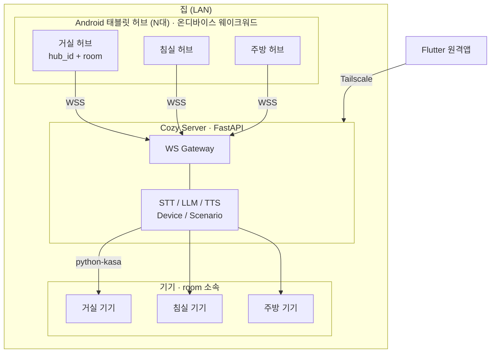
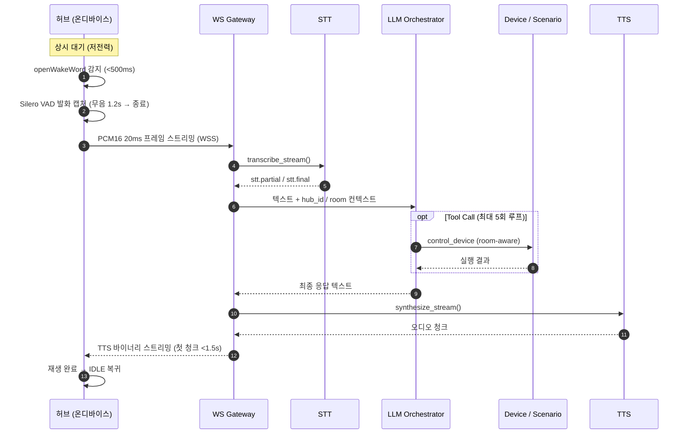
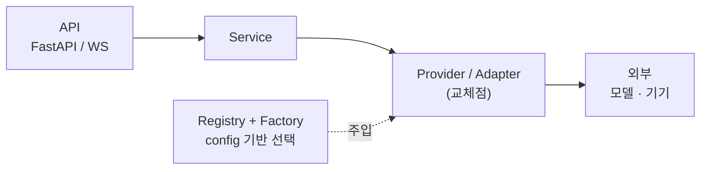
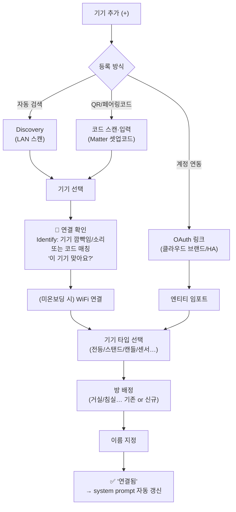
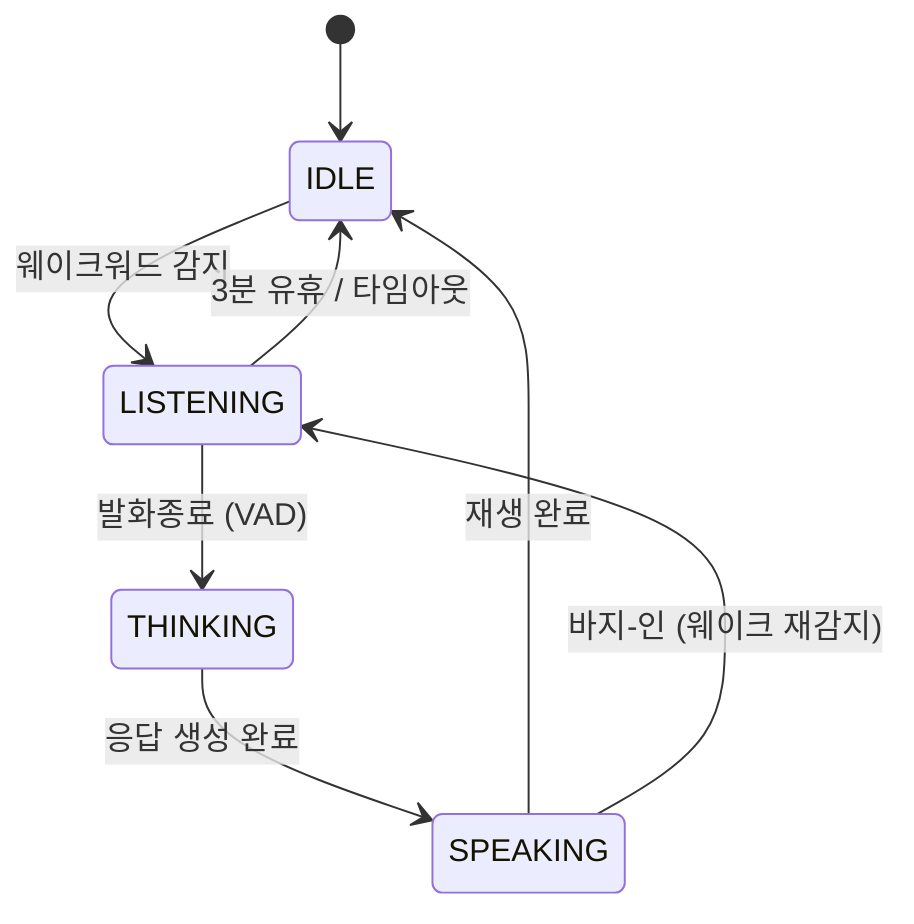
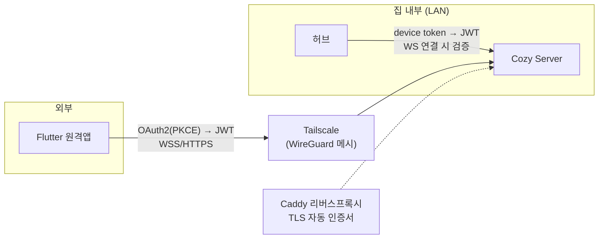
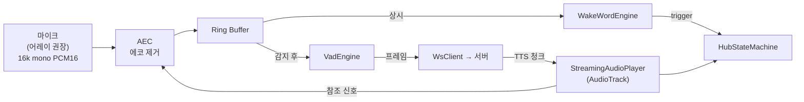
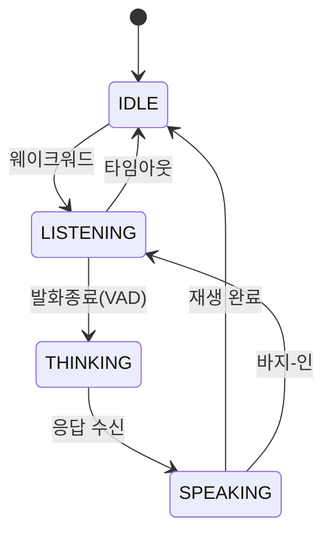
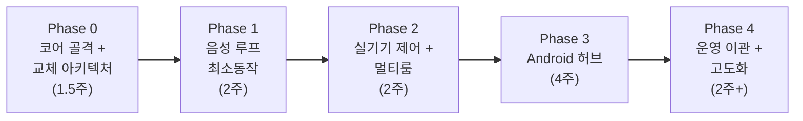

# Cozy Buddy — 스마트홈 AI 비서 설계서 (v2)

> 로컬 우선(온프레미스) 음성 스마트홈 비서. 실시간 동작 최우선, 전 구성요소 부품처럼 교체 가능한 아키텍처.

---

## 0. 설계 원칙 (Non-Negotiable)

| # | 원칙 | 의미 |
|---|------|------|
| P1 | **실시간 최우선** | 웨이크→응답 지연 최소화가 모든 결정의 1순위 |
| P2 | **부품 교체 가능** | STT·TTS·LLM·WakeWord·Device 전부 인터페이스 뒤로 숨김. `.env` 한 줄로 교체 |
| P3 | **로컬 우선** | 기본 동작은 LAN 내 완결. 외부는 선택적 확장 |
| P4 | **멀티룸/멀티허브** | 방마다 기기, 방마다 태블릿 허브. 공간 인지형 제어 |
| P5 | **온디바이스 웨이크워드** | 서버 웨이크 없음. 프라이버시·지연·대역폭 전부 유리 |
| P6 | **도메인 기반 패키징** | Package-by-Feature. 레이어별(`api/`,`services/`) 아님. 기능=폴더, 추가·삭제·MSA분리를 폴더째로 |

---

## 1. 스택 결정

### 1-1. 서버 = FastAPI (Python) 유지 — Spring Boot 전환 ❌

**근거**
- AI/IoT 생태계 전부 파이썬 네이티브: `faster-whisper`, `openWakeWord`, `piper`, `python-kasa`, `chromadb`, `sentence-transformers`, vLLM/llama.cpp 바인딩
- Spring 전환 시 → 위 스택을 전부 버리거나, Python 추론 마이크로서비스를 별도로 두는 **폴리글랏 운영 부담** 발생 (가정용엔 과함)
- 보안/인증은 전환 사유가 안 됨:
  - FastAPI도 OAuth2 + JWT 성숙 (`fastapi-users`, `authlib`)
  - Spring Security의 강점(엔터프라이즈 SSO·복잡 RBAC)은 이 프로젝트 규모에 불필요
  - 외부 노출 리스크는 **Tailscale(WireGuard 기반 VPN)** 로 대부분 제거 (§7)

**결론**: FastAPI 유지. 훗날 Spring이 필요해지면 API/Auth 게이트웨이 계층만 교체 가능하도록 경계를 명확히 둔다.

### 1-2. 기술 스택 (교체 가능 표기)

| 영역 | 기본 구현 | 교체 후보 | 교체 방식 |
|------|----------|----------|----------|
| 웨이크워드 | openWakeWord (온디바이스) | Porcupine, Sherpa-onnx KWS | Android 인터페이스 impl |
| STT | faster-whisper | whisper.cpp, CLOVA, Deepgram | `STT_PROVIDER` env |
| LLM | vLLM + Llama 3.1 8B | OpenAI, Gemini, llama.cpp | `LLM_PROVIDER` env |
| TTS | Piper (한국어) | 클라우드 TTS | `TTS_PROVIDER` env |
| IoT | python-kasa (Tapo) | IR, Matter, MQTT | DeviceAdapter impl |
| 통신 | WebSocket(WSS) | — | — |
| DB | SQLAlchemy 2.0 + SQLite | PostgreSQL | `DATABASE_URL` |
| VAD | Silero VAD (온디바이스) | webrtcvad | Android 인터페이스 impl |

---

## 2. 시스템 토폴로지 (멀티룸/멀티허브)



**멀티룸 핵심 규칙**
- 모든 기기는 `room` 속성 보유
- 허브는 배치된 `room`을 알고, 모든 발화 요청에 `hub_id` + `room` 동봉
- "불 꺼줘" → 말한 허브의 room 기준 해석. 명시적("침실 불")이면 override
- 서버는 허브별 세션을 독립 관리

---

## 3. 음성 파이프라인 (실시간)



---

## 4. 통신 프로토콜 (WebSocket)

### 4-1. 왜 WebSocket인가
- **gRPC bidi**: 타입세이프·효율적이나 Android+Python 스트리밍 셋업 부담, 오디오 프레이밍 수작업
- **WebRTC**: AEC/지터버퍼 내장은 매력적이나 P2P·NAT traversal 복잡도 과함 (가정용 LAN엔 불필요)
- **WebSocket**: LAN 실시간 오디오 + 양방향 제어의 **최적 균형점**. 단일 연결로 제어·오디오 동시

### 4-2. 프레임 구조 (단일 WS, 타입 구분)
- **텍스트 프레임 (JSON)** = 제어/상태
- **바이너리 프레임** = 오디오 (첫 1바이트 = 스트림 태그, 나머지 = PCM/Opus payload)

```jsonc
// 허브 → 서버: 세션 시작
{ "type": "utterance.start", "hub_id": "living-01", "room": "living",
  "session_id": "uuid", "audio": { "codec": "pcm16", "rate": 16000, "ch": 1 } }

// 허브 → 서버: 발화 종료 (VAD)
{ "type": "utterance.end", "session_id": "uuid" }

// 서버 → 허브: STT 부분/최종 결과
{ "type": "stt.partial", "text": "거실 불" }
{ "type": "stt.final", "text": "거실 불 꺼줘" }

// 서버 → 허브: 상태 전환 / TTS 프레이밍
{ "type": "state", "value": "thinking" }
{ "type": "tts.start", "codec": "pcm16", "rate": 22050 }  // 이후 바이너리 프레임
{ "type": "tts.end" }

// 서버 → 허브: 최종 텍스트(자막용) / 에러
{ "type": "response", "text": "거실 조명을 껐어요" }
{ "type": "error", "code": "device_offline", "message": "..." }
```

### 4-3. 연결 관리
- 허브당 **영속 WS 1개**, 앱 시작 시 연결 + 하트비트(ping/pong)
- 끊김 → 지수 백오프 재연결 (1s→2s→4s… 최대 30s)
- 연결 중이라도 **웨이크워드는 로컬에서 계속 동작**

---

## 5. 서버 아키텍처 (도메인 + 확장성)

### 5-0. 패키징 원칙 — 도메인 기반 (Package-by-Feature)

- **기능(도메인) 단위로 묶는다.** 레이어별(`app/api`, `app/services`, `app/crud`에 전 도메인 모아두기) **금지**
- 한 도메인 = 폴더 하나: `api·service·crud·schemas·models`를 자기 폴더 안에 자족적으로 보유
- 근거: **응집도↑** (기능 추가=폴더 하나), 삭제=폴더째, **MSA 분리=폴더째 들어내기**. 도메인 늘수록 유리
- 도메인 간 공유 코드만 `core/`, 미들웨어만 `middleware/`
- 레이어 기반은 도메인 1~2개 초소형에서만 허용 — cozy-buddy는 도메인 5개+라 해당 없음

### 5-1. 계층



### 5-2. 패키지 구조
```
app/
├── main.py                      # 앱 + 라우터 자동등록 + WS 게이트웨이
├── config.py                    # pydantic-settings (provider 선택 env)
│
├── core/
│   ├── database.py  websocket.py  exceptions.py
│   ├── logging.py  i18n.py  security.py       # JWT/토큰 (신규)
│   └── registry.py                            # 범용 Provider 레지스트리 (신규)
│
├── domain/
│   ├── voice/                   # STT/TTS만 (웨이크워드 서버에서 제거)
│   │   ├── api.py
│   │   ├── providers/
│   │   │   ├── stt_base.py      # STTProvider (ABC)
│   │   │   ├── stt_faster_whisper.py
│   │   │   ├── tts_base.py      # TTSProvider (ABC)
│   │   │   └── tts_piper.py
│   │   └── factory.py           # env → provider 인스턴스
│   │
│   ├── llm/
│   │   ├── service.py           # Orchestrator (tool loop)
│   │   ├── adapters/            # vllm/openai/gemini
│   │   ├── prompts/
│   │   └── tools/               # registry + device/scenario/info tools
│   │
│   ├── device/                 # 브랜드 무관 (Tapo 단정 X)
│   │   ├── service.py           # room-aware 제어
│   │   ├── models.py            # Device(room, device_type, adapter_type, config)
│   │   ├── taxonomy.py          # DeviceType/Capability 정의 (확장형)
│   │   └── adapters/            # DeviceAdapter(ABC)
│   │       ├── tapo.py          # python-kasa (기본)
│   │       ├── matter.py        # Matter (권장·견고)
│   │       ├── homeassistant.py # HA 어댑터 (미구현, 슬롯만)
│   │       └── ir.py
│   │
│   ├── scenario/                # 시나리오 + 스케줄러
│   ├── chat/                    # 대화 세션·컨텍스트·요약
│   └── auth/                    # 페어링·토큰 발급 (신규)
│
└── middleware/
```

### 5-3. Provider 교체 패턴 (P2 구현)
```python
# stt_base.py
class STTProvider(ABC):
    @abstractmethod
    async def initialize(self) -> None: ...
    @abstractmethod
    async def transcribe(self, pcm: bytes, *, rate: int) -> STTResult: ...
    async def transcribe_stream(self, chunks) -> AsyncIterator[STTPartial]: ...

# factory.py
_STT_REGISTRY: dict[str, type[STTProvider]] = {
    "faster-whisper": FasterWhisperSTT,
    "clova": ClovaSTT,          # 나중에 추가
}
def build_stt() -> STTProvider:
    return _STT_REGISTRY[settings.stt_provider]()
```
→ **새 STT 추가 = 클래스 1개 + 레지스트리 1줄 + `.env` 변경.** 코어 무수정.
→ LLM·TTS·Device·(Android)WakeWord 전부 동일 패턴.

### 5-4. 기기 모델 & 등록 (브랜드 무관 + 방/타입 기반)

**원칙**: **Tapo로 단정하지 않는다.** 기기는 `adapter_type`(브랜드/프로토콜)과 `device_type`(용도)를 **분리**해 관리 → 어떤 IoT든 어댑터만 추가하면 편입.

**Device 모델**
| 필드 | 예시 | 설명 |
|---|---|---|
| `name` | "거실 스탠드" | 사용자 지정 |
| `room` | living/bedroom/kitchen | **방 소속** (멀티룸 해석 기준) |
| `device_type` | light/lamp/candle/plug/sensor/hub… | **용도**(아래 taxonomy, 확장형) |
| `adapter_type` | tapo/matter/homeassistant/ir | **제어 방식**(브랜드 무관) |
| `capabilities` | on_off, brightness, color, temp… | 타입에서 파생, 어댑터가 실제 지원 표기 |
| `config` | {host, creds…} | 어댑터별 |

**DeviceType taxonomy** (Nest Hub 방식 차용, `taxonomy.py`에서 확장)
```
조명류:   light(전등) · lamp(스탠드) · candle(캔들) · strip(스트립)
전원류:   plug(플러그) · switch(스위치)
센서류:   motion · temperature · humidity · contact · light_sensor
허브류:   hub(Tapo 허브 등)
확장:     thermostat · fan · curtain · lock · camera …
```
→ 각 타입은 **기본 capability 프로파일**을 가짐 (예: light=on_off+brightness+color). 새 타입 추가는 taxonomy 한 곳만 수정.

**등록 플로우** (Google Home / Nest Hub 방식 그대로)


**단계별 대응 (어댑터 무관, 인터페이스 동일)**
| 단계 | Tapo | Matter | HA |
|---|---|---|---|
| 검색/등록 | python-kasa LAN 스캔 | QR 셋업코드 커미셔닝 | 엔티티 임포트(OAuth) |
| **연결 확인** | 기기 깜빡임/on-off 토글로 식별 | Matter **Identify 클러스터**(표준) | HA identify 서비스 |
| WiFi | (Tapo 앱서 사전 온보딩된 걸 편입) | 커미셔닝 중 처리 | HA가 관리 |

- **🔑 연결 확인 = Nest Hub의 코드 매칭에 대응**: cozy-buddy는 **기기 Identify(깜빡임·소리)** 로 "지금 반짝인 게 맞아요?" 확인 → 옆집/다른 방 기기 오등록 방지
- **DeviceAdapter 인터페이스에 `discover()` / `identify()` 추가** → 브랜드마다 구현만 다름, 플로우는 동일
- 등록 즉시 LLM system prompt의 "등록 기기 목록"에 반영 (방+타입 포함) → 공간·용도 인지 제어

**Home Assistant 확장 슬롯**
- 지금은 **직접 어댑터(tapo/matter)** 로 가되, `HomeAssistantAdapter`는 **인터페이스만 열어둠**
- 나중에 HA 얹으면: cozy-buddy device 도메인이 **HA 엔티티를 어댑터 하나로 흡수** → 기존 코드 무변경, 수천 기기·자동화 즉시 확보
- 즉 **"직접 제어 → HA 위임" 전환이 어댑터 교체 한 번**으로 가능하게 설계

---

## 6. 대화/세션 모델



- **세션 단위**: `hub_id` 기준 독립 세션 (거실·침실 동시 대화 가능)
- **컨텍스트**: 최근 10턴 유지 + 초과분은 롤링 요약(무한증가 방지), DB 저장
- **세션 만료**: 3분 유휴 → 컨텍스트 리셋(새 세션)
- **바지-인**: SPEAKING 중 웨이크워드 재감지 → TTS 즉시 중단 후 LISTENING
- **화자**: v1은 단일 가구 가정(화자분리 없음). `user_id` 필드만 미리 열어둠
- **공간 컨텍스트**: system prompt에 발화 허브의 room + 그 방 기기 목록 주입

---

## 7. 보안 / 인증



| 경로 | 방식 |
|------|------|
| 허브 ↔ 서버 | 페어링 시 발급한 device token → 단기 JWT. WS 연결 시 토큰 검증 |
| 원격(Flutter) ↔ 서버 | OAuth2 (PKCE) → JWT, WSS/HTTPS 필수 |
| TLS 종단 | 리버스 프록시(Caddy — 자동 인증서) |
| **외부 접속** | **Tailscale(WireGuard) 권장** → 포트포워딩 X, 암호화 메시. 노출면 최소화 |
| 비밀정보 | `.env` + pydantic-settings, 하드코딩 금지 |

- 페어링 플로우: 서버 발급 코드/QR → 허브 등록 → device token 발급
- v1 LAN-only여도 auth 골격은 처음부터 포함(외부 확장 시 재작업 방지)

---

## 8. 실패/엣지 케이스 정책

| 상황 | 정책 |
|------|------|
| 기기 오프라인 | 2회 재시도(백오프) → 실패 시 구체적 사과 TTS ("거실 조명에 연결이 안 돼요") |
| STT 저신뢰/공백 | 되묻기 ("잘 못 들었어요, 다시 말씀해 주세요") |
| LLM 타임아웃(10s) | 폴백 응답 + 로그, 세션 유지 |
| Tool 루프 초과(5회) | 중단 + 부분 결과 안내 |
| 시나리오 부분 실패 | 성공분 진행 + 실패 기기 목록 보고 |
| 허브↔서버 끊김 | 허브: 오프라인 UI + 로컬 웨이크는 유지 + 지수백오프 재연결 |
| 동시 발화(다중 허브) | 세션 독립 처리, 기기 충돌 시 마지막 명령 우선 + 로그 |

---

## 9. 성능 목표 (SLA)

| 지표 | 목표 |
|------|------|
| 웨이크워드 감지 | < 500ms (온디바이스) |
| 발화종료 → 첫 TTS 소리 (단순) | < 1.5s |
| 발화종료 → 첫 TTS 소리 (툴콜) | < 3s |
| STT (3~5초 발화, GPU) | < 800ms |
| LLM 첫 토큰 (로컬 8B/5080) | < 500ms |
| TTS 첫 청크 (Piper CPU) | < 300ms |
| 가용성 | 베스트에포트(가정용) + 크래시 자동재시작 |

---

## 10. Android 허브 앱 구조 (클라이언트)

Kotlin + Jetpack Compose + **MVVM / Clean Architecture + Hilt**. 서버와 동일하게 **부품 교체(P2)** 철학 적용 — 웨이크워드·VAD를 인터페이스 뒤로 숨김.

### 10-1. 패키지 구조

```
app/
├── di/                          # Hilt 모듈
├── core/
│   ├── audio/
│   │   ├── wakeword/            # WakeWordEngine (interface)
│   │   │   ├── OpenWakeWordEngine   ← 기본
│   │   │   └── PorcupineEngine      ← 교체 후보
│   │   ├── vad/                 # VadEngine (interface) + SileroVad
│   │   ├── capture/            # AudioCapture (AudioRecord, 16k mono PCM16)
│   │   └── playback/          # StreamingAudioPlayer (AudioTrack, 청크 재생)
│   └── network/               # WsClient(OkHttp) + FrameCodec + 재연결
├── service/
│   └── VoiceForegroundService  # 상시 대기(웨이크워드 루프 호스팅)
├── data/
│   ├── repository/            # HubRepository, DeviceRepository
│   └── ws/                    # 메시지 모델·매퍼(§4 프로토콜)
├── domain/
│   ├── model/                 # HubState, Device, Room
│   └── usecase/               # StartListening, StreamUtterance, PlayTts...
└── presentation/
    ├── hub/                   # HubViewModel + 상태머신(StateFlow)
    ├── ambient/               # 앰비언트(시계·날씨·포토프레임)
    ├── conversation/          # 듣는중→처리중→응답 애니메이션
    └── devices/               # 기기 카드 터치 제어
```

> 안드로이드도 **도메인 기반(P6)**: `audio/`는 서브도메인(wakeword·vad·capture·playback)으로 격리, presentation은 화면 도메인별 분리.

### 10-2. 오디오 파이프라인



- 마이크 → **AEC** → 링버퍼 → ⓐ 웨이크워드 상시 / ⓑ 감지 후 VAD 프레임만 WS 전송
- **AEC 필수**: 스피커로 TTS 나오는 동안 마이크가 자기 소리를 되먹음 → 제거 안 하면 **자기 TTS에 반응**. TTS 재생 신호를 참조로 AEC에 투입
- **마이크는 어레이 권장**(ReSpeaker류): HW AEC·빔포밍이 소프트 AEC 부담을 덜고 원거리 인식↑

### 10-3. 상태머신 (단일 진실원본)



- **StateFlow**로 노출 → Compose UI는 구독만. **View에 로직 없음**(규칙 준수)

### 10-4. 핵심 설계 결정

| # | 결정 |
|---|---|
| A1 | **Foreground Service**가 웨이크워드 루프 호스팅 → 화면 꺼져도 상시 대기 (온디바이스, 네트워크 무관) |
| A2 | **WakeWord/VAD 인터페이스 + DI** → 서버 provider 패턴과 대칭. openWakeWord↔Porcupine 교체가 DI 한 줄 |
| A3 | **스트리밍 TTS 재생**: AudioTrack 스트리밍 모드, 청크 즉시 재생 / 바지-인 = track stop + LISTENING |
| A4 | **상시 켜짐 디스플레이**: `KEEP_SCREEN_ON` + 앰비언트(디밍) 모드, Nest Hub 스타일 |
| A5 | **차별점(예쁜 UI)은 presentation 집중**: 앰비언트 + 대화 애니메이션 = 프로젝트 정체성 |
| A6 | **AEC 필수**: TTS 재생 신호를 참조로 마이크 에코 제거. 없으면 자기 목소리에 반응. 바지-인의 전제 |
| A7 | **마이크 어레이(ReSpeaker류) 권장**: HW AEC·빔포밍으로 원거리·소음 대응. 오디오 프론트엔드를 HW로 밀어 소프트 부담↓ |

---

## 11. 개발 로드맵



### Phase 0 — 코어 골격 + 교체 아키텍처 (1.5주)
- [ ] 도메인 구조 + 라우터 자동등록 + config(provider env)
- [ ] Provider 레지스트리/팩토리 패턴 (STT/TTS/LLM 인터페이스 정의)
- [ ] WS 게이트웨이 + 프레임 프로토콜(§4) 구현
- [ ] JWT/페어링 auth 골격

### Phase 1 — 음성 루프 최소동작 (2주)
- [ ] faster-whisper STT provider
- [ ] Piper TTS provider (스트리밍)
- [ ] LLM orchestrator + tool loop
- [ ] 허브↔서버 end-to-end 에코(텍스트→응답) 통과

### Phase 2 — 실기기 제어 + 멀티룸 (2주)
- [ ] python-kasa Tapo 실연동
- [ ] Device room 모델 + room-aware 해석
- [ ] 시나리오 엔진 + APScheduler
- [ ] 실패 정책(§8) 구현

### Phase 3 — Android 허브 (4주)
- [ ] 온디바이스 웨이크워드(openWakeWord TFLite) + WakeWord 인터페이스
- [ ] Silero VAD + AudioRecord 캡처 + WS 클라이언트
- [ ] Foreground Service(상시대기) + 재연결
- [ ] UI (네스트허브 스타일: 시계/날씨/기기카드/대화 애니메이션)
- [ ] TTS 재생 + 바지-인

### Phase 4 — 운영 이관 + 고도화 (2주+)
- [ ] 맥미니(llama.cpp Metal 32B) 이관
- [ ] Tailscale 외부 접속 + Flutter 원격앱
- [ ] RAG, 날씨/뉴스 tools, 커스텀 웨이크워드
