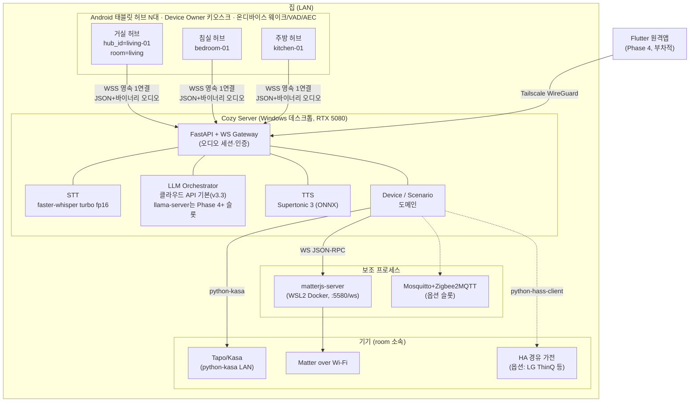
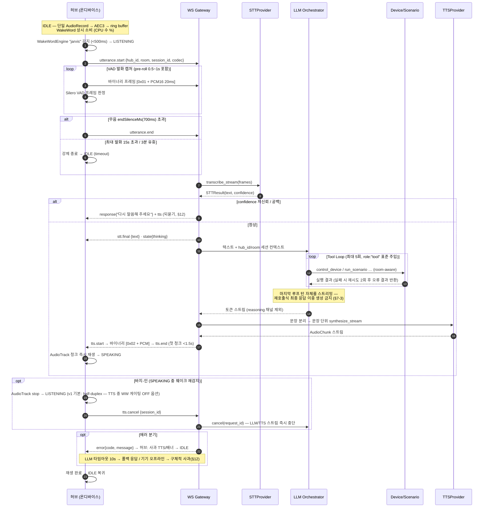
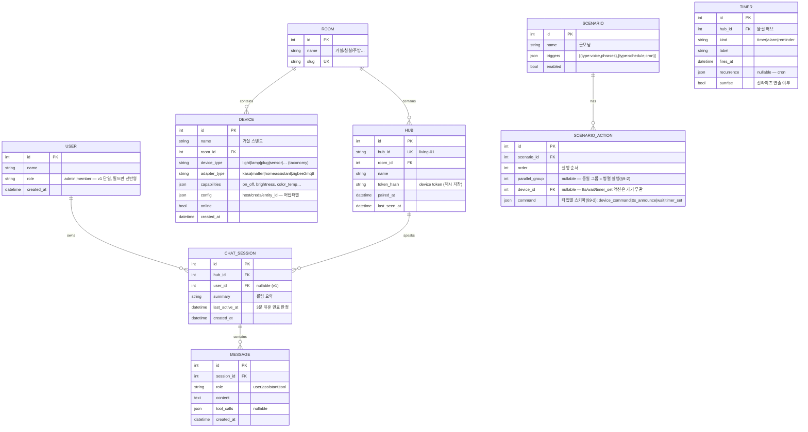
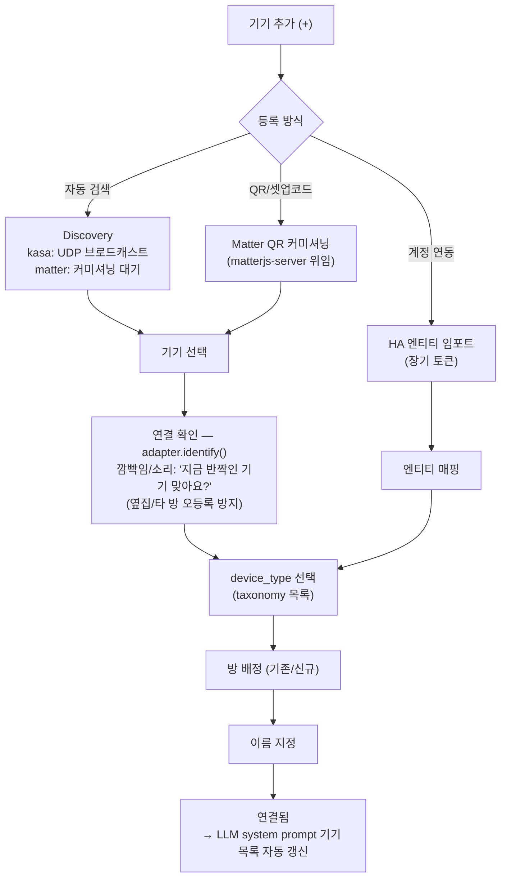
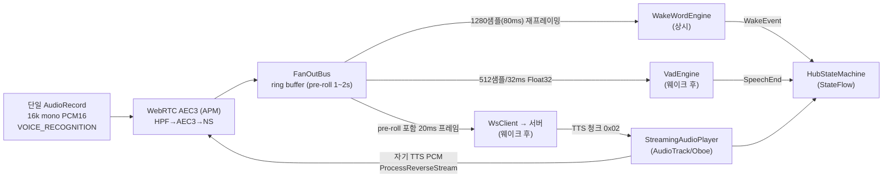
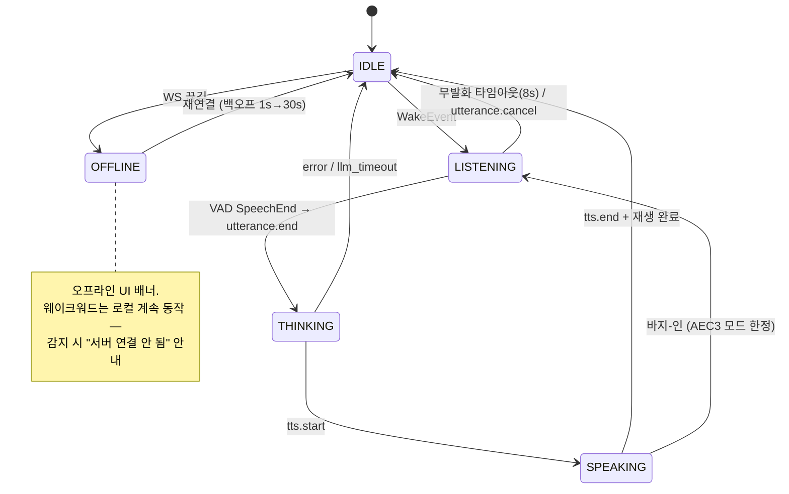
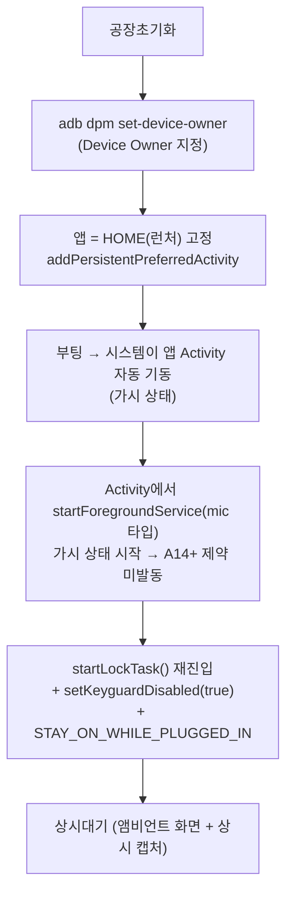
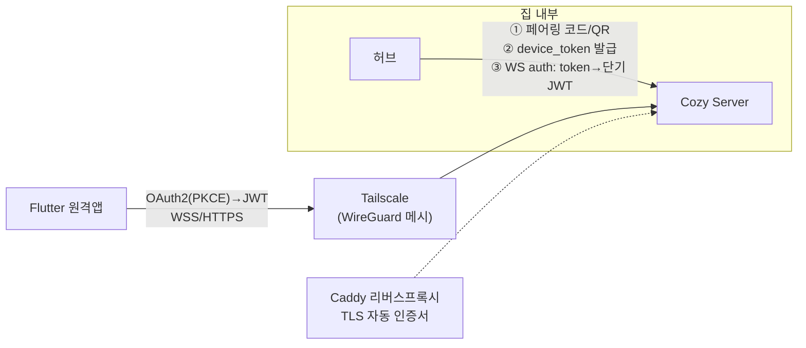
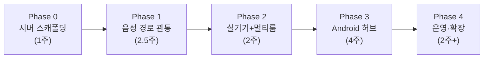

# Cozy Buddy — 최종 통합 설계서 v3

> **버전:** v3 · **작성일:** 2026-07-16
> 자가호스팅 스마트홈 음성 AI 비서. Google Nest Hub 2세대의 기능을 로컬 우선으로 커버하되, LLM 대화 품질로 Nest Hub의 최대 약점을 정면 공략한다.
> v2(2025) 설계를 계승하고, 2026-07 기술 리서치(웨이크워드·STT·TTS·LLM·IoT·Android 오디오)와 현재 코드 분석 결과로 갱신했다. **갱신된 결정에는 사유를 명기한다.**
> **v3.1 (2026-07-16):** 웨이크워드를 **"jarvis"로 확정** — Porcupine 기본 채택 철회(Free 티어 MAU 3·계정 제한), openWakeWord `hey_jarvis` 사전학습 모델 기본으로 변경. 폴백 엔진 없음(Vosk 성능 부적합 판정). §0-3·§2-1·§3·§11·§12·§14 반영.
> **v3.2 (2026-07-16):** DB 기본을 **PostgreSQL**로 확정(SQLite는 개발/테스트 슬롯 — 사용자 숙련도 + 다수 REST API 서빙 고려). LLM 라인업을 **로컬 llama.cpp + 클라우드 3종(Gemini/OpenAI/Claude)** 으로 확정, 클라우드 API 키 관리 정책 추가. §3-3·§6-2·§7-5·§11·§13·§14 반영.
> **v3.3 (2026-07-16):** **클라우드 우선 개발로 전환** — v1은 클라우드 LLM(3종 중 택1)으로 전 기능을 완성하고, 로컬 llama.cpp+Qwen3.5-9B는 **Phase 4+ 옵션으로 이연**(비용 분석 결과 캐싱+저사용량으로 월 $10~25 수준 — 비용이 로컬의 근거가 아님. 로컬의 가치는 프라이버시·오프라인·지연 일관성으로 재정의). §1·§3-3·§7-5·§12-2·§13·§14 반영.
> **v3.4 (2026-07-16):** **그린필드 확정** — 기존 레포 3개(server/hub/remote)를 재사용하지 않고 신규 레포에서 본 설계서를 스펙으로 처음부터 구현. §14 로드맵을 "기존 코드 정비"에서 "신규 구현"으로 재구성, 문서 곳곳의 현행 코드 마이그레이션 주석 제거(§4·§5·§6·§7).

---

## 0. 개요 · 포지셔닝 · 설계 원칙

### 0-1. 포지셔닝

> **"Nest Hub의 예쁜 UI와 스마트홈 통합은 그대로, 딸리던 두뇌는 로컬 LLM으로, 클라우드·구독 종속은 로컬·무료로."**

- **제1 목적:** IoT(스마트홈) 기기 **음성 제어** — 웨이크워드→발화→기기 실행→음성 응답 루프가 존재 이유.
- **벤치마크:** Google Nest Hub 2세대. 그 기능 수준을 커버하되 **수면 측정은 스코프에서 제외한다**(Soli 레이더 HW 의존 — 한 줄 언급으로 종결).
- **최대 차별점:** LLM 대화 품질(Nest Hub의 정형 명령 한계를 자연어 이해로 돌파) + 로컬 우선(프라이버시·무료·무구독).
- **구성:** 자가호스팅 서버(Windows 데스크톱: RTX 5080 16GB / Ryzen 7 7800X3D / 32GB RAM) + Android 태블릿 허브(방마다 N대) + 선택적 Flutter 원격앱(Phase 4).

### 0-2. 설계 원칙 (Non-Negotiable) — v2 계승

| # | 원칙 | 의미 |
|---|------|------|
| P1 | **실시간 최우선** | 웨이크→응답 지연 최소화가 모든 결정의 1순위 |
| P2 | **부품 교체 가능** | WakeWord·VAD·STT·TTS·LLM·IoT 어댑터 전부 인터페이스 뒤로. `.env`/설정 한 줄 교체 |
| P3 | **로컬 우선** | 기본 동작은 LAN 내 완결. 클라우드는 옵트인 확장 슬롯 |
| P4 | **멀티룸/멀티허브** | 방마다 기기, 방마다 허브. 공간 인지형(room-aware) 제어 |
| P5 | **온디바이스 웨이크워드** | 서버 웨이크 없음. 프라이버시·지연·대역폭 전부 유리 |
| P6 | **도메인 기반 패키징** | Package-by-Feature. 기능=폴더, 추가·삭제·분리를 폴더째로 |

### 0-3. v2 → v3 주요 갱신 요약 (리서치로 뒤집힌 결정)

| 영역 | v2 결정 | v3 결정 | 갱신 사유 |
|---|---|---|---|
| 웨이크워드 | openWakeWord 기본 | **openWakeWord 기본 복귀** (v3.1) — 워드를 "jarvis"(영어)로 확정, 공식 사전학습 `hey_jarvis` ONNX 사용. 커스텀 재학습 경로는 LiveKit wakeword(openWakeWord ONNX 호환 출력) | 당초 Porcupine 채택 사유가 "한국어 커스텀 워드 즉시 생성" 단 하나였는데 jarvis 확정으로 소멸. Porcupine Free 티어(MAU 3기기·비상업·학습 월 3회·다중 계정 차단)는 실사용 부적합 → 상용 슬롯으로 강등 |
| TTS | Piper(한국어) | **Supertonic 3** | Piper는 **한국어 공식 보이스가 없고** 원본 2025-10 아카이브. Supertonic은 한국어 네이티브 품질 + RTF 0.005 + VRAM 사실상 0 |
| LLM 서빙 | vLLM | **llama.cpp llama-server** (vLLM은 승격 슬롯) — **v3.3: 도입을 Phase 4+로 이연, v1은 클라우드 우선** | Windows 네이티브 + sm_120 지원 + VRAM 세밀 제어(`--n-gpu-layers`) + `--cache-reuse`. vLLM은 VRAM 선점 할당이 STT/TTS 동거와 충돌, WSL2 필수 |
| LLM 모델 | Llama 3.1 8B | **Qwen3.5-9B-Instruct Q4_K_M** | Llama는 한국어 약세. Qwen3.5는 한국어·툴콜·Apache 2.0·~6GB 4박자 |
| STT compute | (미지정) | **float16 필수** | RTX 5080(Blackwell)은 CTranslate2 INT8 미지원(4.6.x에서 sm120 INT8 비활성화) |
| Matter | python-matter-server 전제 | **matterjs-server** 클라이언트 | python-matter-server는 8.1.2로 deprecated 종료. matterjs-server가 WS 호환 후계 |
| AEC | "AEC 필수" 원론 | **WebRTC AEC3(APM) + 자기 TTS PCM reference 주입** | 플랫폼 AcousticEchoCanceler는 기기 편차로 신뢰 불가가 실측 결론. 자체 TTS라 reference를 직접 보유 |
| 상시대기 | FGS만 언급 | **Device Owner + HOME 앱 고정(키오스크)** | A14+에서 백그라운드/BOOT_COMPLETED mic FGS 시작 금지 → 가시 Activity에서 시작하는 구조적 우회가 유일한 정석 |
| Android 패키징 | `presentation/` 레이어 | **feature-first(`feature/<name>`)** | 코드 분석 결과 실제 착수 컨벤션이 feature-first이고 P6(도메인 기반) 철학과도 부합 — 설계 쪽을 코드에 맞춰 통일 |
| Ollama | (언급 없음) | 기본 백엔드 제외, OpenAI 호환 제네릭 어댑터의 한 프로필로 존치 | `/v1` 스트리밍 툴콜 유실 버그 + HA 커뮤니티 툴콜 실패 사례(llama.cpp에선 정상) |

v2에서 **계승하는 결정:** FastAPI 유지(Spring 전환 없음), WebSocket 단일 연결(텍스트=제어 JSON/바이너리=오디오), Package-by-Feature, 멀티룸 hub_id+room 규칙, Tailscale 외부접속, 페어링→device token→JWT, 등록 플로우(Discovery/QR/Identify), 마이크 어레이 권장.

---

## 1. 시스템 토폴로지



**멀티룸 핵심 규칙 (v2 계승)**
- 모든 기기·허브는 `room` 소속. 허브는 모든 요청에 `hub_id` + `room` 동봉.
- "불 꺼줘" → 발화 허브의 room 기준 해석. 명시적("침실 불")이면 override.
- 서버는 `hub_id` 기준 독립 세션 — 거실·침실 동시 대화 가능.

---

## 2. 기능 명세 (Nest Hub 2 대비, P0/P1/P2)

기존 feature-spec을 계승하되, 리서치 반영 항목(굵게)을 갱신했다.
범례: 🟢 P0(MVP) · 🟡 P1(1차 확장) · 🔵 P2(후순위) · ⚫ 제외 / 처리: 로컬·클라우드·하이브리드

### 2-1. 음성 비서 (핵심 대체 타깃)

| 기능 | Nest Hub | cozy-buddy | 우선순위 | 처리 |
|---|---|---|---|---|
| 웨이크워드 | "Hey Google" | **"jarvis" — openWakeWord 사전학습 `hey_jarvis` ONNX**. 완전 오프라인·기기 무제한·Apache-2.0. 한국식 발음/"자비스" 단독 호출 미탐 시 LiveKit wakeword로 재학습(무료 무제한) | 🟢 | 로컬 |
| 명령/Q&A | 클라우드 종속 | **로컬 LLM(Qwen3.5-9B) — 핵심 차별점** / 클라우드 폴백 옵트인 | 🟢 | 하이브리드 |
| 연속 대화 | Voice Match 필요 | 바지-인 + hub별 세션 유지 (v1은 half-duplex 기본, AEC3 플래그) | 🟢 | 로컬 |
| 화자 구분 | 최대 6명 | v1 단일 가구, `user_id` 필드만 선반영 | 🔵 | 로컬 |
| 통역 모드 | ~29개 언어 | 클라우드 STT/번역/TTS 조합 시 가능 | 🔵 | 클라우드 |
| 다국어 | 다수 | 한국어 우선, i18n 리소스 분리 | 🟢 | — |

### 2-2. 스마트홈 제어 (본진)

| 기능 | Nest Hub | cozy-buddy | 우선순위 | 처리 |
|---|---|---|---|---|
| 음성 제어 | 정형 명령 | LLM Tool Calling → device 도메인 (room-aware) | 🟢 | 하이브리드 |
| 홈 대시보드 | Home View | 방별 기기 카드 터치 제어 | 🟢 | 로컬 |
| 루틴/자동화 | Google Home 루틴 | scenario 도메인 + APScheduler | 🟢 | 로컬 |
| **Matter** | 컨트롤러 내장 | **matterjs-server 경유, Wi-Fi Matter 1차** (Thread는 TBR 확보 시) | 🟡 | 로컬 |
| 카메라 피드 | 라이브 뷰 | RTSP/WebRTC 로컬 스트림 — 스트림 URL 조회 API(§5-2) + 대시보드 카메라 카드→전체화면(§10-5) | 🟡 | 로컬 |
| 카메라 이벤트 이력 | Nest Aware 구독 | 로컬 저장 = 무료 차별점 | 🔵 | 로컬 |
| Thread 보더라우터 | 내장 | 별도 TBR(동글/기존 허브) 필요 — 1차 제외 | 🔵 | 로컬 |

### 2-3. 디스플레이 / 앰비언트

| 기능 | Nest Hub | cozy-buddy | 우선순위 | 처리 |
|---|---|---|---|---|
| 상시 시계 화면 | 풀스크린 시계 | Compose 앰비언트 + `KEEP_SCREEN_ON` + `STAY_ON_WHILE_PLUGGED_IN` | 🟢 | 로컬 |
| 자동 밝기/야간 디밍 | 조도 센서 | 태블릿 조도 센서 + 시간 기반 (번인·스웰링 대책 겸용) | 🟢 | 로컬 |
| 포토 프레임 | Google Photos | 로컬 폴더/NAS 슬라이드쇼 | 🟡 | 로컬 |
| Ambient EQ(색온도) | RGB 센서 | 시간대 기반 근사 | 🔵 | 로컬 |
| 큐레이션 아트 | Google 제공 | 제외 | ⚫ | — |

### 2-4. 일상 / 생산성 / 커뮤니케이션 / 기타

| 기능 | cozy-buddy | 우선순위 | 처리 |
|---|---|---|---|
| 타이머/알람 (다중) | 서버 스케줄 + 허브 재생 | 🟢 | 로컬 |
| Good Morning/Night 루틴 | scenario 도메인 (§9 예시) | 🟢 | 로컬 |
| 선라이즈 알람 | 앰비언트 점증 밝기 + 볼륨 점증 | 🟡 | 로컬 |
| 리마인더/할일 | 로컬 DB + LLM tool | 🟡 | 로컬 |
| 날씨/뉴스 | 외부 API tool | 🟡 | 클라우드 |
| Quick Settings(밝기/볼륨/알람/DND) | **인앱 퀵설정 패널(§10-5)** — Device Owner 키오스크(§10-4)가 시스템 상태바/QS를 차단하므로 네이티브 QS 활용 불가, 앱 내 구현으로 대체 | 🟢 | 로컬 |
| 인터콤(LAN 방송) | 멀티허브 구조라 자연 구현 — `broadcast` tool(§7-2) + REST(§5-2) | 🟡 | 로컬 |
| 음악/영상 | 태블릿 네이티브 앱 활용 — **LockTask allowlist 등록 전제(§10-4)** | 🟡/🔵 | 클라우드 |
| 블루투스 스피커 출력 | 태블릿 BT 페어링 — TTS/알람/미디어 외부 스피커 재생 (BT 레이턴시로 AEC 제약 → §10-2) | 🟡 | 로컬 |
| 마이크 뮤트 | 소프트 토글(+A12 QS 하드 뮤트 안내) | 🟡 | 로컬 |
| 레시피/커뮤트 | LLM 대화/외부 API | 🔵 | 하이브리드 |
| 캐스트 수신·멀티룸 오디오 | Snapcast 등 검토 | 🔵 | 로컬 |
| 영상통화 | 카메라 추가 시(Nest 초과) | 🔵 | 클라우드 |
| **수면 감지** | **스코프 제외** (Soli HW 의존) | ⚫ | — |
| 에어 제스처 / 음성통화 | 제외 | ⚫ | — |

---

## 3. 모듈 추상화 설계 (핵심장)

모든 교체 가능 요소는 **인터페이스(ABC/Kotlin interface) + 레지스트리/팩토리 + 설정 한 줄** 3종 세트로 구현한다. 새 구현 추가 = 클래스 1개 + 레지스트리 데코레이터 1줄 + `.env` 변경, 코어 무수정.

### 3-1. Android — WakeWordEngine / VadEngine (Kotlin)

```kotlin
/** 웨이크워드 엔진 계약. 어댑터가 프레임 재버퍼링·score debounce·자산/키 관리를 전담한다. */
interface WakeWordEngine {
    /** 감지 이벤트 스트림. score는 0~1 정규화(이진 엔진은 1.0 고정). */
    val events: Flow<WakeEvent>

    /**
     * 비동기 초기화. 실패(모델 자산 손상/메모리, 상용 엔진의 라이선스 검증 불가 등)는
     * [WakeWordError]로 노출 — 폴백 엔진 없음(§12-1). 상위 레이어가 오류 UI + 백오프 재시도 담당.
     */
    suspend fun initialize(config: WakeWordConfig)

    /** 16kHz mono PCM16 push. 엔진별 요구 프레임(Porcupine 512, oww 1280)은 내부 ring buffer로 재프레이밍. */
    fun processFrame(pcm: ShortArray)

    /** 0.0~1.0 단일 노브 — oww는 threshold 역매핑(+debounce), Porcupine은 sensitivity 직결. */
    fun setSensitivity(value: Float)

    fun release()
}

data class WakeEvent(val keywordId: String, val score: Float, val timestampMs: Long)

data class WakeWordConfig(
    val provider: String,                 // "openwakeword" | "porcupine"(상용 슬롯)
    val sensitivity: Float = 0.5f,
    val params: Map<String, String> = emptyMap(),  // .onnx 경로, 모델 dir, .ppn/AccessKey(상용) 등 불투명 수납
)
```

```kotlin
/** VAD 계약. Silero v5는 512샘플(32ms)/Float32 고정 — 변환은 어댑터 책임. */
interface VadEngine {
    suspend fun initialize(config: VadConfig)
    /** 프레임 판정. 발화 종료는 연속 무음 [VadConfig.endSilenceMs] 초과 시 SpeechEnd. */
    fun processFrame(pcm: ShortArray): VadResult
    fun reset()
    fun release()
}

sealed interface VadResult {
    data object Silence : VadResult
    data class Speech(val probability: Float) : VadResult
    data class SpeechEnd(val utteranceMs: Long) : VadResult
}

data class VadConfig(
    val provider: String = "silero",      // "silero" | "webrtc"
    val threshold: Float = 0.6f,          // WARNING: audioSource의 AGC 잔존 여부와 한 세트로 튜닝
    val endSilenceMs: Int = 700,
    val maxUtteranceMs: Int = 15_000,
)
```

교체는 Hilt 모듈 한 줄:

```kotlin
@Provides @Singleton
fun wakeWordEngine(settings: HubSettings): WakeWordEngine = when (settings.wakeWordProvider) {
    "openwakeword" -> OpenWakeWordEngine() // 기본 — hey_jarvis.onnx (onnxruntime-android 3단 파이프라인)
    "porcupine" -> PorcupineEngine()       // 상용 슬롯 (Free 티어 MAU 3 — §11)
    else -> error("unknown wakeword provider")
}
```

추가로 오디오 계층 전체가 provider 경계를 가진다: `AudioSourceProvider`(VOICE_RECOGNITION 기본/UNPROCESSED 옵션) → `AecProvider`(NoopAec/PlatformAec/WebRtcAec3) → `FanOutBus`(ring buffer) → WakeWord/Vad/SttStream 소비자 (§10).

### 3-2. 서버 — Python ABC 4종

```python
# core/registry.py — 범용 레지스트리 (모든 provider 공통)
T = TypeVar("T")

class ProviderRegistry(Generic[T]):
    """도메인별 provider 등록/생성. 데코레이터 등록 + settings 기반 build."""
    def __init__(self, kind: str) -> None: ...
    def register(self, name: str) -> Callable[[type[T]], type[T]]: ...
    def build(self, name: str, **kwargs: Any) -> T:
        """미등록 name이면 ProviderNotFoundError (영어 하드코딩 예외)."""
```

```python
# domain/voice/providers/stt_base.py
class STTProvider(ABC):
    @abstractmethod
    async def initialize(self) -> None: ...

    @abstractmethod
    async def transcribe(
        self, pcm: bytes, *, rate: int = 16000, lang: str = "ko",
        initial_prompt: str | None = None,      # 기기명·방 이름 주입 → 고유명사 인식률 개선
    ) -> STTResult: ...

    async def transcribe_stream(
        self, frames: AsyncIterator[bytes], *,
        on_partial: Callable[[STTPartial], Awaitable[None]] | None = None,
    ) -> STTResult:
        """기본 구현: 프레임 버퍼링 후 transcribe() 위임 (partial 미발화).
        CLOVA gRPC 등 진짜 스트리밍 provider가 override. 인터페이스에 미리 정의해 확장 대비."""

    @abstractmethod
    async def shutdown(self) -> None: ...

@dataclass
class STTResult:
    text: str
    confidence: float          # 저신뢰 되묻기 정책(§12) 판단용
    duration_ms: int
```

```python
# domain/voice/providers/tts_base.py
class TTSProvider(ABC):
    @abstractmethod
    async def initialize(self) -> None: ...

    @abstractmethod
    def synthesize_stream(
        self, text: str, *, voice: str | None = None,
    ) -> AsyncIterator[AudioChunk]:
        """문장 단위 입력 → 오디오 청크 스트림. 비스트리밍 엔진(Supertonic)도
        문장별 합성→즉시 yield로 체감 지연 최소화 (파이프라인 규약 §4)."""

    def capabilities(self) -> TTSCapabilities: ...   # streaming/voices/emotions 플래그

@dataclass
class AudioChunk:
    pcm: bytes
    rate: int = 24000
    is_last: bool = False
```

```python
# domain/llm/providers/base.py — 리서치 §4.2 계약 그대로
class LLMProvider(ABC):
    @abstractmethod
    def chat_stream(
        self,
        messages: list[Message],
        *,
        tools: list[ToolSchema] | None = None,       # parallel tool calls 포함
        response_format: JsonSchema | None = None,   # 구조화 출력
        options: GenOptions | None = None,
    ) -> AsyncIterator[ChatDelta]:
        """ChatDelta = TextDelta | ToolCallDelta(id·name·arguments 누적) | Done(finish_reason, usage).
        스트리밍 중 툴콜이 1급 시민 — 엔진별 파싱 편차는 어댑터가 흡수.
        reasoning(thinking) 토큰은 별도 채널로 분리(음성으로 읽으면 안 됨)."""

    @abstractmethod
    async def health(self) -> ProviderHealth: ...    # 라우터 폴백 판단

    @abstractmethod
    def capabilities(self) -> LLMCapabilities: ...   # tools/json_schema/vision/reasoning 플래그

    @abstractmethod
    async def cancel(self, request_id: str) -> None: ...  # 바지-인 시 즉시 중단 — 음성 UX 필수
```

```python
# domain/device/adapters/base.py
class DeviceAdapter(ABC):
    adapter_type: ClassVar[str]

    @abstractmethod
    async def discover(self) -> list[DiscoveredDevice]: ...
    @abstractmethod
    async def identify(self, device: Device) -> None:
        """기기 깜빡임/소리로 물리 식별 — 등록 플로우 '연결 확인' 단계(§8)."""
    @abstractmethod
    async def get_state(self, device: Device) -> DeviceState: ...
    @abstractmethod
    async def execute(self, device: Device, command: DeviceCommand) -> CommandResult: ...
    async def subscribe(self, device: Device) -> AsyncIterator[DeviceState]:
        """상태 push (HA/MQTT 어댑터 구현, 폴링 어댑터는 기본 NotSupported)."""
```

### 3-3. `.env` 교체 매트릭스 (기본값 = 리서치 확정, 후보 = 어댑터 슬롯)

| 키 | 기본값 | 교체 후보 | 근거(요약) |
|---|---|---|---|
| `STT_PROVIDER` | `faster-whisper` | `clova`(gRPC, 진짜 partial) · `rtzr-vito`(한국어 CER 5.91% 1위) · `deepgram` · `openai` · `sensevoice`(저사양) | 로컬 최상위 한국어 품질, turbo fp16 ~2GB, 3~5초 발화 0.2~0.5s |
| `STT_MODEL` | `large-v3-turbo` | `large-v3`(품질 상향) · `ghost613/faster-whisper-large-v3-turbo-korean`(한국어 파인튜닝) | 경로만 교체 |
| `STT_COMPUTE_TYPE` | `float16` | — | **IMPORTANT:** Blackwell(sm_120)은 CTranslate2 INT8 미지원 |
| `TTS_PROVIDER` | `supertonic` | `cosyvoice`(양방향 스트리밍 ~150ms, 클로닝·감정, VRAM 수 GB) · `typecast`(~200ms, 한국어 감정) · `openai-tts` · `gpt-sovits`(커스텀 보이스) · `melo`(CPU 비상) | 한국어 네이티브, RTF 0.005(GPU)/0.015(CPU), VRAM ~0 |
| `LLM_PROVIDER` | **클라우드 3종 중 키 구성된 것(v3.3)**: `gemini` · `openai` · `anthropic`(Claude) — 각 `*_API_KEY` 필수(§11) | `llamacpp`(로컬 — Phase 4+ 도입 시 기본 승격) · `vllm`(동시성 승격, WSL2) · `ollama`(간편 프로필) | 클라우드 우선 개발(v3.3). 키 없는 provider는 라우팅 후보 자동 제외(§7-5). llama.cpp 선정 근거(Windows 네이티브·sm_120·`--cache-reuse`)는 로컬 도입 시 그대로 유효 |
| `LLM_MODEL` | (로컬 도입 시) `Qwen3.5-9B-Instruct Q4_K_M` | `Kanana-2-30B-A3B`(한국어 특화, MoE 전문가 CPU 오프로드) · `Qwen3-8B AWQ` | 한국어·툴콜·Apache 2.0·~6GB |
| `LLM_LIGHT_MODEL` | (로컬 도입 시) `Qwen3.5-4B-Instruct Q4` | Midm 2.0 Mini | 의도분류/단순 툴콜 슬롯(~3GB, 옵션) |
| `IOT_ADAPTERS` | `kasa,matter` | `+homeassistant`(LG ThinQ 등) · `+zigbee2mqtt` | 직접 어댑터 우선 + HA 슬롯 하이브리드 |
| (Android) `wakeword.provider` | `openwakeword` (`hey_jarvis` 사전학습) | `porcupine`(상용 슬롯) — 폴백 없음(§12-1) | jarvis 확정으로 사전학습 모델 무료 사용(제약 0). 커스텀 재학습은 LiveKit wakeword — openWakeWord ONNX 호환 출력 |
| (Android) `vad.provider` | `silero` | `webrtc` | v5 512샘플, ~0.3–1ms/프레임 |
| (Android) `aec.provider` | `webrtc-aec3` | `noop` · `platform` | 플랫폼 AEC 기기 편차 → SW AEC가 정답 |
| (Android) `audio.source` | `VOICE_RECOGNITION` | `UNPROCESSED`(지원 선언 기기 한정) | OEM AGC 잔존 편차 → 설정 교체 필수 |

---

## 4. 음성 파이프라인 전체 흐름



**설계 포인트**
- **pre-roll**: 웨이크 감지 시점 이전 0.5~1s ring buffer 내용까지 STT에 전달 — 첫 음절 유실 방지 (리서치 확인 함정).
- **partial STT 미사용**: 1~5초 명령에선 발화 단위 일괄 전사가 더 정확·단순. `stt.partial` 타입은 프로토콜에 예약(스트리밍 provider 교체 시 활용).
- **지연 지배 요인은 VAD 종료 판정(0.5~0.8s)** — STT가 아님. endSilenceMs 튜닝이 실질 승부처.
- **TTS 파이프라인 규약**: LLM 토큰 스트림 → 문장 분리기 → 문장 단위 합성 → 청크 재생. Supertonic(비스트리밍)도 첫 문장 완성 즉시 발화로 체감 지연 최소화.

---

## 5. 통신 프로토콜

허브당 **영속 WS 1개** (`/ws/hub`). 텍스트 프레임 = JSON 제어, 바이너리 프레임 = 오디오(첫 1바이트 스트림 태그). 끊김 → 지수 백오프 재연결(1s→2s→…→30s), 웨이크워드는 오프라인에도 로컬 동작.

### 5-1. WS 메시지 카탈로그 (전체)

| 방향 | type | payload 핵심 필드 | 설명 |
|---|---|---|---|
| H→S | `auth` | `device_token` | 연결 직후 1회. 실패 시 서버가 `auth.error` 후 close |
| S→H | `auth.ok` | `hub_id`, `room`, `server_time` | 인증 성공 + 허브 설정 동기화 |
| S→H | `auth.error` | `code` | `invalid_token` / `revoked` |
| H→S | `utterance.start` | `session_id`, `hub_id`, `room`, `audio{codec:"pcm16",rate:16000,ch:1}` | 발화 세션 시작 |
| H→S | *(binary)* `0x01`+PCM | — | 업링크 마이크 오디오 20ms 프레임 |
| H→S | `utterance.end` | `session_id` | VAD 발화 종료 |
| H→S | `utterance.cancel` | `session_id` | 허브측 취소(타임아웃 등) |
| H→S | `text.query` | `session_id`, `text` | 음성 우회 텍스트 입력(디버그/터치 UI) |
| H→S | `tts.cancel` | `session_id` | 바지-인 — 서버 LLM/TTS 스트림 중단 |
| H→S | `ping` / S→H `pong` | `ts` | 하트비트 (25s 간격) |
| H→S | `hub.status` | `volume`, `mic_muted`, `brightness` | 허브 상태 보고(대시보드/원격앱 표시용) |
| S→H | `stt.partial` | `session_id`, `text` | (예약) 스트리밍 STT provider 사용 시 |
| S→H | `stt.final` | `session_id`, `text`, `confidence` | 자막 표시용 |
| S→H | `state` | `value: listening\|thinking\|speaking\|idle` | 허브 UI 상태 전환 지시 |
| S→H | `llm.delta` | `session_id`, `text` | 응답 텍스트 토큰(자막 실시간 표시) |
| S→H | `tool.status` | `tool`, `status: running\|ok\|failed` | "조명 끄는 중…" 진행 표시 |
| S→H | `response` | `session_id`, `text` | 최종 응답 전문(자막 확정) |
| S→H | `tts.start` | `session_id`, `codec`, `rate` | 이후 바이너리 다운링크 개시 |
| S→H | *(binary)* `0x02`+PCM | — | 다운링크 TTS 오디오 청크 |
| S→H | `tts.end` | `session_id` | 재생 스트림 종료 |
| S→H | `error` | `code`, `message`(i18n), `session_id?` | `llm_timeout` / `device_offline` / `tool_loop_exceeded` … — **STT 저신뢰/공백은 error가 아닌 정상 `response`(되묻기) 경로로 처리(§4·§12)** |
| S→H | `device.state_changed` | `device_id`, `state` | 대시보드 실시간 갱신 (subscribe 어댑터/제어 후 push) |
| S→H | `timer.fired` | `timer_id`, `label`, `kind: timer\|alarm\|reminder` | 허브가 알람음/선라이즈 연출/리마인더 TTS 재생 |
| S→H | `scenario.executed` | `scenario_id`, `results[]` | 부분 실패 목록 포함 |
| S→H | `broadcast` | `from_hub`, `text\|audio_ref` | 인터콤/방송 (P1). `audio_ref` = 서버가 text를 TTS 합성한 결과 참조 ID — 수신 허브는 `tts.start`→`0x02` 스트림과 동일 경로로 수신·재생. 발신은 `broadcast` tool(§7-2) 또는 `POST /api/broadcast`(§5-2) |
| S→H | `config.updated` | `keys[]` | 서버측 설정 변경 통지 → 허브 재로드 |

### 5-2. REST API 엔드포인트 (문서화는 Swagger UI `/docs`)

| 도메인 | Method · Path | 설명 |
|---|---|---|
| auth | `POST /api/auth/pairing` | 페어링 코드 발급(서버 콘솔/기존 허브에서) |
| auth | `POST /api/auth/pair` | 코드 제출 → `device_token` 발급 (허브 등록) |
| auth | `POST /api/auth/token` | device_token → 단기 JWT 갱신 |
| auth | `DELETE /api/auth/hubs/{hub_id}` | 허브 등록 해제(토큰 폐기) |
| hub | `GET /api/hubs` · `PATCH /api/hubs/{id}` | 허브 목록/room 배정·이름 변경 |
| room | `GET/POST /api/rooms` · `PATCH/DELETE /api/rooms/{id}` | 방 CRUD |
| device | `GET/POST /api/devices` · `GET/PATCH/DELETE /api/devices/{id}` | 기기 CRUD |
| device | `POST /api/devices/discover` | 어댑터별 LAN 스캔 (`?adapter=kasa`) |
| device | `POST /api/devices/commission` | Matter 페어링 코드/QR 제출 → matterjs-server 커미셔닝 위임(§8-2 QR 경로) |
| device | `POST /api/devices/{id}/identify` | 깜빡임/소리 물리 식별 |
| device | `POST /api/devices/{id}/command` | 터치 제어 실행 `{capability, value}` |
| device | `GET /api/devices/{id}/state` | 현재 상태 조회 |
| device | `GET /api/devices/{id}/stream` | 카메라 스트림 URL 조회(RTSP/WebRTC) — 대시보드 카메라 카드→전체화면 뷰(§10-5), P1 |
| scenario | `GET/POST /api/scenarios` · `GET/PATCH/DELETE /api/scenarios/{id}` | 시나리오 CRUD |
| scenario | `POST /api/scenarios/{id}/run` | 즉시 실행 |
| timer | `GET/POST /api/timers` · `DELETE /api/timers/{id}` | 타이머/알람 CRUD |
| broadcast | `POST /api/broadcast` | 인터콤/방송 `{target: room\|hub_id\|all, text}` → 서버 TTS 합성 후 대상 허브들에 `broadcast` push(§5-1) |
| chat | `GET /api/chat/sessions` · `GET /api/chat/sessions/{id}/messages` | 대화 이력 |
| chat | `POST /api/chat/message` (+`/api/chat/ws`) | 텍스트 채팅(음성 우회·디버그) |
| voice | `POST /api/voice/stt` · `POST /api/voice/tts` | 파일 단위 STT/TTS(디버그용) |
| rag | `POST /api/rag/ingest` · `POST /api/rag/query` | 지식베이스(구현은 기존 레포 rag 도메인 참고 — §14-1) |
| settings | `GET/PATCH /api/settings` | provider 선택 등 런타임 설정 |
| system | `GET /health` · `GET /api/system/status` | 헬스체크 / GPU·provider 상태 |

> llm 도메인에는 `api.py`를 두지 않는다(라우터 자동등록에서 자연 제외) — LLM 디버그는 `/api/chat/message`와 `/api/system/status`(provider health 집계)로 충분.

---

## 6. 서버 아키텍처

### 6-1. 도메인 구조 (Package-by-Feature, v2 계승 + auth/voice 확장)

```
app/
├── main.py                  # 라우터 자동등록(domain/*/api.py 스캔) + lifespan(provider warm-up)
├── config.py                # pydantic-settings — §3-3 매트릭스 키 전부
├── core/
│   ├── database.py  exceptions.py  i18n.py  logging.py
│   ├── registry.py          # ProviderRegistry[T] (신규 — 도메인 제각각 방식 통일)
│   ├── security.py          # JWT 발급/검증, device token 해시 (신규)
│   └── websocket.py         # HubConnectionManager (hub_id 키 관리)
├── domain/
│   ├── auth/                # 페어링·토큰 (신규) — api·service·crud·schemas·models
│   ├── voice/               # api·service(세션 상태머신)·providers/
│   │   └── providers/  stt_base.py  stt_faster_whisper.py  stt_clova.py(슬롯)
│   │                   tts_base.py  tts_supertonic.py  tts_cosyvoice.py(슬롯)
│   │                   # 웨이크워드 서버 코드 없음 — P5: 온디바이스 전용
│   ├── llm/                 # service.py=Orchestrator(tool loop 소속) · providers/ · prompts/ · tools/
│   ├── chat/                # hub_id 세션·롤링 요약·이력 (tool loop는 llm 소속)
│   ├── device/              # service(room-aware)·taxonomy.py(신규)·adapters/{base,kasa,matter,homeassistant,zigbee2mqtt}
│   ├── scenario/            # service·engine(실행부 신규)·scheduler(APScheduler 실연동)
│   ├── timer/               # 타이머/알람 (신규 도메인)
│   └── rag/                 # 완성분 유지
├── middleware/              # error_handler · request_logger (유지)
└── locales/                 # ko.json (+en.json 슬롯)
```

**도메인별 책임**

| 도메인 | 책임 | 비고 |
|---|---|---|
| auth | 페어링 코드 발급, device token 저장(해시), JWT 발급/검증 | §11 |
| voice | 오디오 세션 상태머신, STT/TTS provider 오케스트레이션, 문장 분리→TTS 파이프라인 | WS 게이트웨이의 오디오 처리 본체 |
| llm | **Orchestrator**: system prompt 조립, tool loop, 라우팅(로컬/클라우드), provider 관리 | tool loop는 chat이 아닌 llm 소속 — 음성(voice)·텍스트(chat) 양 진입점이 재사용 |
| chat | hub_id별 세션, 최근 10턴 + 롤링 요약, 3분 만료, 이력 저장 | 세션 키 = hub_id (§7-4) — 전역 단일 대화 금지 |
| device | 기기 CRUD, room-aware 해석, 어댑터 디스패치, 실패 정책(재시도) | 어댑터 계약 §3-2 · 모델 §6-2 · taxonomy/등록/해석 §8 |
| scenario | 시나리오 CRUD·실행 엔진(액션 순차/병렬 실행)·APScheduler 트리거 | 실행 규칙 §9-2 · 모델은 SCENARIO_ACTION 분리(§6-2) |
| timer | 타이머/알람 등록·발화(APScheduler)·허브 push | Nest Hub P0 기능 |
| rag | 지식베이스 (ChromaDB + e5-small) — 완성, `search_knowledge` tool 연결 | 설계보다 선행 구현된 자산 |

### 6-2. DB 스키마



DB는 **SQLAlchemy 2.0(async) + PostgreSQL 16 기본** (v3.2 확정 — 사용자 숙련도 + 다수 REST API 서빙에 유리: 동시 쓰기·JSONB·인덱스·운영 도구). 드라이버 asyncpg, 스키마 이력은 **Alembic** 마이그레이션으로 관리(§14-2 Phase 0). `DATABASE_URL` 교체로 SQLite도 동작하나(개발 간편 슬롯) JSONB 등 dialect 차이가 있으므로 통합 테스트는 PostgreSQL 컨테이너 기준.

---

## 7. LLM 오케스트레이터

### 7-1. System Prompt 구성요소 (안정 접두부 → 프리픽스 캐시 적중이 TTFT를 좌우)

| 순서 | 블록 | 내용 | 변동성 |
|---|---|---|---|
| 1 | 페르소나 | "너는 Cozy Buddy…" — `locales/ko.json`의 `prompt.system` (i18n 준수) | 고정 |
| 2 | 응답 스타일 규약 | **TTS 낭독 전제**: 1~2문장, 마크다운/이모지 금지, 숫자·단위 한글 낭독형 | 고정 |
| 3 | tool 사용 정책 | 모호하면 확인 질문, 파괴적 동작(전체 소등 등) 확인, 실패 시 사실대로 보고 | 고정 |
| 4 | 등록 기기 목록 | 방별 그룹 `{room: [name(device_type, capabilities)]}` — 기기 등록/변경 시 갱신 | 저변동 |
| 5 | 공간 컨텍스트 | 발화 허브의 `room` + 그 방 기기 강조("현재 발화 위치: 거실") | 세션별 |
| 6 | 시각 컨텍스트 | 현재 날짜/시각/요일 | 턴별 (말미 배치로 캐시 훼손 최소화) |

### 7-2. Tool 목록 + JSON 스키마

툴 스키마는 도메인별 서브셋 노출(15개 이상이면 소형 모델 오작동 보고 — 리서치). v1 노출 세트:

> `get_news`(날씨/뉴스 P1의 뉴스 축)는 **v1 노출 세트 제외** — Phase 4에서 get_weather와 동일 패턴으로 추가(§14-2).

```jsonc
// control_device — 기기 제어 (제1 목적)
{ "name": "control_device",
  "parameters": { "type": "object", "properties": {
      "device": { "type": "string", "description": "기기 이름 또는 '거실 불' 같은 자연어 지칭" },
      "room":   { "type": "string", "description": "명시된 방. 생략 시 발화 허브의 방" },
      // IMPORTANT: enum은 §8-1 taxonomy의 쓰기 가능 capability 전체에서 동적 생성 — 하드코딩 금지
      "capability": { "type": "string", "enum": ["on_off","brightness","color_temp","color","target_temp","speed","position","lock"] },
      "value": { "description": "on/off, 0-100, 2700-6500K, hex, 목표온도, open/close 등 capability별" }
    }, "required": ["device","capability","value"] } }

// query_device — 상태 조회
{ "name": "query_device",
  "parameters": { "type": "object", "properties": {
      "device": { "type": "string" }, "room": { "type": "string" },
      "attribute": { "type": "string", "description": "state|brightness|temperature|humidity…" }
    }, "required": ["device"] } }

// run_scenario — 시나리오 실행
{ "name": "run_scenario",
  "parameters": { "type": "object", "properties": {
      "name": { "type": "string", "description": "시나리오 이름 (굿모닝/굿나잇 등)" }
    }, "required": ["name"] } }

// set_timer — 타이머/알람
{ "name": "set_timer",
  "parameters": { "type": "object", "properties": {
      "kind": { "type": "string", "enum": ["timer","alarm","reminder"] },
      "duration_sec": { "type": "integer", "description": "타이머용" },
      "at": { "type": "string", "description": "ISO8601 또는 'HH:MM' — 알람/리마인더용" },
      "label": { "type": "string" }
    }, "required": ["kind"] } }

// cancel_timer
{ "name": "cancel_timer", "parameters": { "type": "object", "properties": {
      "label": { "type": "string" }, "timer_id": { "type": "integer" } } } }

// broadcast — 인터콤/방송 (P1): "주방으로 방송해줘" → 서버가 message를 TTS 합성 후
// 대상 허브들에 broadcast{audio_ref} push (§5-1). REST 경로는 POST /api/broadcast (§5-2)
{ "name": "broadcast", "parameters": { "type": "object", "properties": {
      "target": { "type": "string", "description": "대상 room 이름 또는 hub_id. 생략 시 전체(발화 허브 제외)" },
      "message": { "type": "string", "description": "방송할 내용" }
    }, "required": ["message"] } }

// get_weather — 외부 API (P1)
{ "name": "get_weather", "parameters": { "type": "object", "properties": {
      "location": { "type": "string", "description": "생략 시 집 위치" },
      "when": { "type": "string", "enum": ["now","today","tomorrow"] } } } }

// search_knowledge — RAG (기존 완성분)
{ "name": "search_knowledge", "parameters": { "type": "object", "properties": {
      "query": { "type": "string" } }, "required": ["query"] } }
```

### 7-3. Tool Loop 규칙

| 규칙 | 내용 |
|---|---|
| 최대 반복 | 5회(`MAX_TOOL_ITERATIONS`). 초과 시 중단 + 부분 결과 안내("일부만 처리했어요…") |
| 결과 주입 | **OpenAI 표준 `role:"tool"` + `tool_call_id`** — `role:"user"` 텍스트 주입 금지(비표준, 모델별 품질 저하) |
| 스트리밍 | **마지막 턴 자체를 스트리밍으로 수행** — tool_calls 없는 델타가 오면 그대로 사용자 응답. "루프 완료 후 재호출" 방식의 이중 생성 금지(지연·비용 2배) |
| 확인 질문 정책 | ① 대상 모호(동일 이름 다수) ② 파괴적/광역 동작(전체 소등, 잠금) ③ 저신뢰 STT — 이 3경우만 되묻기. 그 외 즉시 실행(대화 왕복 최소화 = 음성 UX) |
| 병렬 툴콜 | provider capabilities에 따라 허용 — 시나리오성 다중 기기는 `run_scenario` 유도 |
| reasoning 분리 | thinking 토큰은 자막·TTS로 내보내지 않음 (ChatDelta 채널 분리) |

### 7-4. 컨텍스트/세션 관리

- **세션 키 = `hub_id`** (거실·침실 독립). `user_id`는 v1 nullable 선반영.
- **최근 10턴 원문 + 초과분 롤링 요약**(summary 컬럼) — 무한 증가 방지.
- **3분 유휴 만료** → 새 세션(컨텍스트 리셋). 이력은 DB 보존.
- tool 결과 메시지도 세션에 저장(role:"tool") — 후속 지시("그거 다시 켜줘") 해석용.

### 7-5. 로컬↔클라우드 라우팅 정책 (LLMRouter)

> **v3.3:** v1은 **클라우드 단일 provider**로 동작 — 아래 라우팅 정책(민감도 fail-closed 로컬 고정 포함)은 **로컬 LLM 도입(Phase 4+) 후 활성화**된다. 도입 전까지 `LLM_CLOUD_FALLBACK`은 무의미(클라우드가 기본). 단 LLMRouter 골격과 provider `health()`/키 검증은 Phase 0부터 구현해 전환 비용을 0으로 유지.

| 축 | 정책 |
|---|---|
| 민감도 | 집안 상태·개인 데이터 포함 요청은 **fail-closed 로컬 고정** (클라우드 불가 시 실패, 우회 없음) |
| 복잡도 | IoT 툴콜·짧은 질의 → 로컬 / 긴 창작·복잡 추론 → 클라우드(**옵트인 설정** `LLM_CLOUD_FALLBACK=off` 기본, `LLM_CLOUD_PROVIDER`로 gemini/openai/anthropic 중 지정) |
| 가용성 | 로컬 `health()` 실패/타임아웃 → (옵트인 시) 클라우드 폴백, 재시도·쿨다운 포함 |
| API 키 | 클라우드 3종은 서버 `.env`의 `GEMINI_API_KEY` / `OPENAI_API_KEY` / `ANTHROPIC_API_KEY`(§11). **키 미설정 provider는 레지스트리 build 시점에 라우팅 후보에서 자동 제외** — 명시 선택 시엔 명확한 오류("API key not configured") |
| 구현 | 자체 경량 라우터(LiteLLM Proxy 상주는 과잉) — 설정 스키마만 model alias + fallback chain 개념 차용 |

---

## 8. 디바이스 도메인

### 8-1. Taxonomy — `device_type × adapter_type × capability` 분리 (v2 계승·확장)

```python
# domain/device/taxonomy.py — 새 타입 추가는 이 파일 한 곳만 수정
DEVICE_TYPES: dict[str, set[str]] = {
    # 조명류
    "light":  {"on_off", "brightness", "color_temp"},
    "lamp":   {"on_off", "brightness"},
    "strip":  {"on_off", "brightness", "color"},
    "candle": {"on_off"},
    # 전원류
    "plug":   {"on_off", "energy"},
    "switch": {"on_off"},
    # 센서류 (읽기 전용)
    "motion": {"occupancy"}, "temperature": {"temperature"},
    "humidity": {"humidity"}, "contact": {"contact"},
    # 허브/확장
    "hub": set(), "thermostat": {"on_off", "target_temp"},
    "fan": {"on_off", "speed"}, "curtain": {"position"},
    "lock": {"lock"}, "camera": {"stream"},
}
```

- `device_type` = 용도(LLM이 이해하는 어휘) / `adapter_type` = 제어 방식(브랜드·프로토콜) / `capabilities` = 타입 기본 프로파일 ∩ 어댑터 실지원.
- 어댑터 실태 (리서치 확정):

| adapter_type | 라이브러리/경로 | 단계 | 비고 |
|---|---|---|---|
| `kasa` | **python-kasa** (Tapo+Kasa 통합, LAN KLAP) | 1차 | HA 공식 tplink 백엔드 = 사실상 표준. Tapo 계정 자격증명 필요(로컬 핸드셰이크용). plugp100은 선택 이유 소멸 |
| `matter` | **matterjs-server** WS 클라이언트 (:5580/ws) | 1차 | python-matter-server deprecated(8.1.2 종료) → 후계로 구현. **Wi-Fi Matter만** 1차, Thread는 TBR 확보 시 |
| `homeassistant` | python-hass-client (WS + 장기 토큰) | 슬롯 | LG ThinQ 등 국내 클라우드 가전용. HA 전면 위임은 단일 장애점+이중 관리라 배제 |
| `zigbee2mqtt` | aiomqtt — `{base}/{name}/set` JSON + exposes 메타 | 슬롯 | Zigbee 센서 도입 시 |
| (주의) SmartThings | — | 회피 | 2026-10 API 유료화($4.99/월) → 삼성 기기는 **Matter 경로 우선** |

### 8-2. 등록 플로우 (Nest Hub 방식 계승 + Identify)



### 8-3. Room-aware 해석 규칙

1. tool 인자에 `room` 명시 → 그 방에서 탐색.
2. 미명시 → **발화 허브의 room 우선** 탐색.
3. 해당 방에 후보 없음 → 전체 탐색, 유일하면 실행 + "안방 가습기를 켰어요"처럼 위치 명시 응답.
4. 다수 매칭 → 확인 질문("거실이랑 침실에 스탠드가 있어요. 어느 쪽이요?").
5. 이름 매칭은 정규화(공백/조사 제거) + device_type 별칭("불"→light|lamp) 순.

---

## 9. 시나리오 · 루틴 · 타이머/알람

### 9-1. 트리거 종류

| 트리거 | 정의 | 구현 |
|---|---|---|
| 음성 | `triggers: [{type:"voice", phrases:["굿모닝","좋은 아침"]}]` | LLM `run_scenario` tool — phrases는 프롬프트 힌트, 최종 매칭은 LLM |
| 시각(1회) | `{type:"at", datetime}` | APScheduler `DateTrigger` |
| 스케줄(반복) | `{type:"schedule", cron:"0 7 * * 1-5"}` | APScheduler `CronTrigger` (타임존 Asia/Seoul) |
| (확장) 센서 | `{type:"state", device_id, condition}` | 어댑터 subscribe → 이벤트 매칭 (P2) |

### 9-2. 실행 엔진 규칙

- 액션은 `order` 순 직렬 기본, 동일 `parallel_group` 값의 액션들은 병렬 실행(§6-2 SCENARIO_ACTION 컬럼).
- `command` json은 액션 타입별 스키마: `{type:"device_command", capability, value}` / `{type:"tts_announce", hub, template|text_key}` / `{type:"wait", sec}` / `{type:"timer_set", kind, at|duration_sec, label}`.
- **기기 참조는 `device_id` FK가 정본** — "침실 스탠드"·room+device_type 같은 자연어 지칭은 시나리오 등록/편집 시점에 해석해 device_id로 정규화한다(§9-3 예시의 이름 표기는 편집 UI 입력 형태).
- **부분 실패 정책(§12):** 성공분 진행 + 실패 기기 목록을 `scenario.executed` 메시지와 TTS로 보고.
- 스케줄러는 앱 lifespan에서 기동, DB의 enabled 시나리오/타이머를 로드해 잡 등록 — 재시작 내구성.

### 9-3. 예시

```jsonc
// Good Morning — 평일 07:00 or "굿모닝"
{ "name": "굿모닝",
  "triggers": [{ "type": "schedule", "cron": "0 7 * * 1-5" }, { "type": "voice", "phrases": ["굿모닝", "좋은 아침"] }],
  "actions": [
    { "order": 1, "command": { "type": "device_command", "device": "침실 스탠드", "capability": "brightness", "value": 30 } },
    { "order": 2, "command": { "type": "device_command", "device": "거실 조명", "capability": "on_off", "value": "on" } },
    { "order": 3, "command": { "type": "tts_announce", "hub": "bedroom-01", "template": "morning_brief" } }  // 날씨 브리핑 (get_weather tool 경유; 일정 브리핑은 캘린더 연동 P2 슬롯 — v1 미포함)
  ] }

// Good Night — "잘자" / 23:30
{ "name": "굿나잇",
  "triggers": [{ "type": "voice", "phrases": ["굿나잇", "잘자", "자러 갈게"] }],
  "actions": [
    { "order": 1, "command": { "type": "device_command", "room": "living", "device_type": "light", "capability": "on_off", "value": "off" } },
    { "order": 2, "command": { "type": "device_command", "device": "침실 스탠드", "capability": "brightness", "value": 10 } },
    { "order": 3, "command": { "type": "tts_announce", "hub": "bedroom-01", "text_key": "scenario.goodnight" } } ] }
```

타이머/알람은 timer 도메인이 APScheduler로 관리, 발화 시 `timer.fired`를 대상 허브로 push — 허브가 알람음(선라이즈면 밝기 점증 연출) 재생. 알람 정지는 음성("알람 꺼줘" → `cancel_timer`)/터치 양쪽.

---

## 10. Android 허브 앱

### 10-1. 모듈 구조 — **feature-first로 통일** (분석 §3-3 결정 반영)

신규 앱을 이 구조로 스캐폴딩한다(기존 hub 레포는 미사용 — §14). `core/` + `feature/`(feature-first) 컨벤션 — P6(도메인 기반)과 부합.

```
app/  (단일 모듈, Kotlin 2.x + Compose + Hilt + MVVM)
├── di/                          # Hilt 모듈 (provider 바인딩 = §3-1 교체점)
├── core/
│   ├── audio/
│   │   ├── capture/             # AudioCapture — 단일 AudioRecord(16k mono PCM16, VOICE_RECOGNITION)
│   │   ├── aec/                 # AecProvider: NoopAec | PlatformAec | WebRtcAec3(APM)
│   │   ├── bus/                 # FanOutBus — lock-free ring buffer(pre-roll 1~2s) + 소비자별 재프레이밍
│   │   ├── wakeword/            # WakeWordEngine: OpenWakeWordEngine(기본, hey_jarvis.onnx) | PorcupineEngine(상용 슬롯)
│   │   ├── vad/                 # VadEngine: SileroVad(onnxruntime-android, CPU/XNNPACK 고정 — NNAPI deprecated)
│   │   └── playback/            # StreamingAudioPlayer(AudioTrack/Oboe) — TTS PCM을 AEC reference로 분기
│   ├── network/                 # WsClient(OkHttp) + FrameCodec(0x01/0x02 태그) + 지수백오프 재연결
│   ├── kiosk/                   # DeviceOwner 헬퍼: LockTask, HOME 고정, Keyguard 해제, STAY_ON
│   └── ui/theme/                # AppColors/AppTypography/AppThemeProvider (빌드 복구 지점)
├── service/
│   └── VoiceForegroundService   # mic 타입 FGS — 가시 Activity에서만 시작 (§10-4)
├── data/
│   ├── repository/              # HubRepository, DeviceRepository, SettingsRepository(DataStore)
│   └── ws/                      # §5-1 메시지 모델(kotlinx-serialization) + 매퍼
├── domain/
│   ├── model/                   # HubState, Device, Room, TimerEvent
│   └── usecase/                 # StartListening, StreamUtterance, PlayTts, BargeIn …
└── feature/
    ├── ambient/                 # 시계·날씨·포토프레임·디밍 (앰비언트 = 기본 화면)
    ├── conversation/            # 듣는중→처리중→응답 자막 애니메이션 오버레이
    ├── dashboard/               # 방별 기기 카드 터치 제어
    └── settings/                # provider·감도·서버 주소·페어링 QR
```

의존성 도입: OkHttp(WS), kotlinx-serialization, navigation-compose, DataStore, onnxruntime-android(Silero VAD + openWakeWord 3단 파이프라인 공용), WebRTC APM(또는 oboe+apm 네이티브), Timber. i18n은 `strings.xml` 엄수.

### 10-2. 오디오 파이프라인 (AEC 포함)



리서치에서 확인된 함정 반영:
- **AudioRecord는 반드시 1개** — 복수 인스턴스는 기기별 마이크 점유 충돌. 팬아웃은 앱 내부.
- **AEC3 출력이 ring buffer에 들어간다**(원신호 아님) — 캡처 스레드에서 `mic → APM → ring` 순서.
- **자기 TTS PCM을 reference로 직접 주입** — Android에 루프백 API가 없어도 자체 재생이라 가능. 이것이 self-wake 무한루프(자기 TTS 키워드에 반응)의 정답.
- 네이티브 추론 엔진은 스레드 안전 규약이 제각각 → 엔진당 단일 HandlerThread 직렬화.
- **바지-인은 v1 옵션**: AEC3 통합 난도가 최고 → v1 기본은 half-duplex(TTS 재생 중 WW 게이팅 OFF), AEC3 경로는 설정 플래그로 점진 검증. 중간 방어로 TTS 중 WW 임계값 상향.
- **BT 스피커 출력 시(§2-4) AEC 제약**: BT 레이턴시(수백 ms, 기기별 가변)로 AEC3 reference 주입 타이밍이 깨짐 → **BT 출력 모드에서는 half-duplex 강제**(바지-인 비활성), 지연 추정 보정은 실측 검증 후에만 옵션 개방.

### 10-3. 상태머신 (StateFlow 단일 진실원본 — View에 로직 없음)



### 10-4. Foreground Service 상시대기 — 플랫폼 제약의 구조적 해소



- **BOOT_COMPLETED 리시버에서 mic FGS 직접 시작 금지**(A14+ 예외 발생) — HOME 자동 기동 경로가 유일한 정석.
- **LockTask allowlist**: `setLockTaskPackages()`에 자기 앱 + 허용 미디어 앱(YouTube/음악 등, §2-4 음악/영상)을 등록 — allowlist 밖 앱·시스템 UI는 차단 유지. 시스템 상태바/Quick Settings는 차단되므로 **밝기/볼륨/알람/DND는 인앱 퀵설정 패널(§10-5)로 제공**(P0).
- microphone 타입 FGS는 **타임아웃 없음** — 가시 시작 후 화면이 꺼져도 캡처 유지.
- 상시 전원이라 Doze 미진입 + FGS 면제 → 상시 캡처는 비-이슈. **실제 리스크는 상시 화면**: 밝기 20~30% 감축, 야간 디밍, 충전 상한 85% 기기 선호(스웰링), LCD 우선(번인).
- Manifest: `INTERNET, RECORD_AUDIO, FOREGROUND_SERVICE, FOREGROUND_SERVICE_MICROPHONE, POST_NOTIFICATIONS, WAKE_LOCK, MODIFY_AUDIO_SETTINGS` + Service/AdminReceiver 선언.

### 10-5. 화면 목록 & UX 규칙

| 화면 | 내용 | UX 규칙 |
|---|---|---|
| 앰비언트(기본) | 풀스크린 시계·날씨·포토프레임, 조도/시간 기반 디밍 | 항상 복귀 지점. 픽셀 회전(번인). 상태 인디케이터 상단 미니멀 |
| 대화 오버레이 | 듣는중(파형)→처리중(애니메이션)→응답(자막 스트리밍 `llm.delta`) | 전체 화면 전환 없이 오버레이 — 앰비언트 위에 얹힘. `tool.status`로 "조명 끄는 중…" 표시 |
| 대시보드 | 방별 기기 카드(토글/슬라이더), `device.state_changed` 실시간 반영. **카메라 카드(P1): 탭 → 전체화면 라이브 뷰** — `GET /api/devices/{id}/stream`(§5-2)으로 RTSP/WebRTC URL 획득 후 재생 | 좌우 스와이프 카드 페이지(Nest Hub 스타일). 카드 탭 = 즉시 제어 |
| 퀵설정 패널(P0) | 화면 밝기·볼륨·알람 목록·DND 토글 — 상단 스와이프/버튼으로 호출 | 키오스크(§10-4)가 시스템 QS를 차단하므로 **인앱 구현이 유일 경로**. 시스템 제어는 Device Owner 권한(DPM)·`AudioManager`·알람은 timer 도메인 연동 |
| 설정 | 서버 주소·페어링 QR, provider/감도, 마이크 소프트 뮤트, 오디오 소스 테스트, **BT 스피커 페어링(§2-4)** | 최초 셋업 시 실기기 캡처 테스트(AGC 여부 검사) 루틴 내장 |

---

## 11. 보안 · 인증



| 항목 | 방식 |
|---|---|
| 허브 페어링 | 서버가 6자리 코드/QR 발급(TTL 5분) → 허브 제출 → `device_token`(랜덤 256bit) 발급, 서버는 **해시만 저장** |
| WS 인증 | 연결 직후 `auth{device_token}` → 검증 → 세션 JWT(내부용, 만료 24h). 토큰 폐기 = 허브 즉시 차단 |
| 원격(Flutter) | OAuth2(PKCE) → JWT. Phase 4 |
| 외부 접속 | **Tailscale** — 포트포워딩 0, 노출면 최소화. 공인 노출 필요 시에만 Caddy TLS |
| 비밀정보 | `.env` + pydantic-settings. Tapo 계정·API 키 하드코딩 금지. LAN-only여도 auth 골격은 Phase 1부터(재작업 방지 — v2 계승) |
| 클라우드 LLM API 키 (v3.2) | `GEMINI_API_KEY`/`OPENAI_API_KEY`/`ANTHROPIC_API_KEY` — **서버 `.env` 전용. DB 저장·허브/원격앱 전달 금지**, loguru 마스킹 필터 적용. `/api/system/status`는 provider별 키 구성 여부(boolean)와 health만 노출, 키 값은 어떤 API로도 노출 안 함. 교체는 `.env` 수정 + 서비스 재시작 |
| 웨이크워드 라이선스 | **기본 openWakeWord(Apache-2.0) — AccessKey·MAU·학습 횟수 제약 없음, 완전 오프라인, 기기 무제한**(P4 멀티허브 확장과 충돌 0). Porcupine은 상용 슬롯으로만 존치 — Free 티어(MAU 3기기·비상업·학습 월 3회·다중 계정 차단)로 기본 채택 철회(v3.1). 사용 시 AccessKey는 허브 로컬 설정(DataStore 암호화)·서버 미경유 |

---

## 12. 실패 정책 · 성능 SLA

### 12-1. 실패 정책 표

| 상황 | 정책 |
|---|---|
| 기기 오프라인/제어 실패 | 어댑터 2회 재시도(지수 백오프 0.5s→1s) → 실패 시 구체적 사과 TTS("거실 조명에 연결이 안 돼요") + `device.online=false` 마킹 |
| STT 저신뢰/공백 | confidence 임계 미달 → 되묻기("잘 못 들었어요"). 무음 환각 방어: `vad_filter=True` + `no_speech_threshold` + 웨이크 후에만 STT |
| LLM 타임아웃(10s) | 스트림 취소 → 폴백 응답 + 로그. 세션 유지. (옵트인 시 클라우드 폴백 먼저 시도) |
| Tool 루프 초과(5회) | 중단 + 부분 결과 안내 |
| 시나리오 부분 실패 | 성공분 진행 + 실패 기기 목록 TTS 보고 |
| 허브↔서버 끊김 | 허브: OFFLINE 배너 + 로컬 웨이크 유지 + 백오프 재연결(1s→30s). 서버: 세션 30s 유예 후 정리 |
| 웨이크워드 엔진 초기화 실패 | **폴백 엔진 없음** (Vosk는 성능 부적합 판정으로 제외 — v3.1). 오류 배너 표시 + 백오프 자동 재시도. 웨이크 불가 중에도 터치 대시보드·`text.query`(§5-1)는 정상 동작 — 완전 먹통 방지. 기본 엔진 openWakeWord는 완전 오프라인(라이선스 검증 없음)이라 실패 모드가 모델 자산 손상/메모리 수준으로 희귀 |
| matterjs-server/HA 다운 | 해당 adapter_type 기기만 오프라인 처리 — 어댑터별 장애 격리(직접 어댑터 채택 이유) |
| 동시 발화(다중 허브) | hub_id 세션 독립 처리. 동일 기기 충돌 시 마지막 명령 우선 + 로그 |
| GPU 프로세스 크래시 | 프로세스 감시(§13) 자동 재시작. 재기동 중 음성 요청 → "잠시 후 다시" 폴백 |
| 서버측 TTS 실패 | 텍스트 응답은 자막으로 송신(무음 + 화면 표시) — 무응답 방지 |

### 12-2. 성능 SLA (리서치 실측 근거로 v2 갱신)

| 지표 | 목표 | 근거 |
|---|---|---|
| 웨이크워드 감지 | < 500ms, 오탐 < 0.5회/h(목표) | openWakeWord 공식 목표치(미탐 <5%, 오탐 <0.5/h) — 임계값+debounce 후처리 전제. 한국식 발음 실측 후 미달 시 LiveKit 재학습으로 보정 |
| VAD 발화 종료 판정 | 0.5~0.8s (endSilenceMs 튜닝) | 전체 지연의 지배 요인 — STT보다 중요 |
| STT (3~5초 발화) | 0.2~0.5s | turbo fp16 @ RTX 5080 보수 추정 |
| LLM TTFT (툴콜 턴) | **클라우드(v1 기본): 0.3~1s + 네트워크 편차** / 로컬(도입 후): 50~200ms(프리픽스 캐시 적중) | 클라우드는 provider 캐시 할인은 있어도 TTFT 보장 없음. 로컬 수치는 llama.cpp `--cache-reuse`+모델 상주 전제 |
| LLM 디코드 | 80~120 tok/s (9B Q4, 로컬 기준) | GDDR7 ~960GB/s 실측 대역. 클라우드는 provider별 상이 |
| TTS 첫 청크 | 수십 ms (1~2문장) | Supertonic RTF 0.005(GPU)/0.015(CPU) |
| **발화종료→첫 TTS 소리 (단순 명령)** | **≤ 2.5s (v1 클라우드)** / ≤ 2s (로컬 도입 후) / ≤ 1.5s (로컬+최적화 조건) | v1: VAD 0.7 + STT 0.4 + **클라우드 LLM 2-pass ~1.0~1.5**(TTFT×2 + 네트워크 왕복) + tool 0.1 + TTS 0.05. 로컬 도입 후: LLM 2-pass 0.6~1.0(툴콜 JSON ~40-50토큰 @80~120tok/s + 2차 응답 개시). **≤1.5s 조건**: 툴콜 arguments 토큰 다이어트 + endSilenceMs 0.5s 하향 + 단순 on/off는 4B 경량 모델(`LLM_LIGHT_MODEL`) 라우팅 |
| 발화종료→첫 TTS 소리 (툴콜 다중/복잡) | ≤ 3s | 루프 2~3회 가정 |
| 가용성 | 베스트에포트(가정용) + 크래시 자동재시작 | v2 계승 |

---

## 13. 배포 · 운영

### 13-1. 프로세스 토폴로지 — **GPU 스택은 Windows 네이티브, 보조 서비스만 WSL2 Docker**

리서치 근거로 결정: llama.cpp는 Windows 네이티브 공식 CUDA 바이너리 + sm_120 지원(vLLM/SGLang은 WSL2 필수), CTranslate2(faster-whisper)·Supertonic(ONNX)도 Windows 네이티브 문제 없음. 반면 matterjs-server는 mDNS/IPv6 요건상 **Linux host-network Docker가 공식 권장** — 따라서 GPU 경로에 가상화 계층을 넣지 않고, Matter만 WSL2로 격리한다. (GPU 서버는 컨테이너 밖에서 구동. Docker 이미지는 CI/테스트용 — python:3.12-slim + uv.)

| 프로세스 | 위치 | 기동/감시 |
|---|---|---|
| (Phase 4+ 로컬 도입 시) `llama-server` (Qwen3.5-9B, `--jinja --cache-reuse`, sm_120 빌드, 상주=언로드 금지) | Windows 네이티브 | NSSM 서비스(자동 재시작) |
| Cozy Server (FastAPI + faster-whisper + Supertonic in-process) | Windows 네이티브 (Python 3.12, Poetry) | NSSM 서비스 |
| matterjs-server | WSL2 Docker (host network, :5580) | `restart: unless-stopped` |
| **PostgreSQL 16** (v3.2) | WSL2 Docker (:5432, named volume 영속화) | `restart: unless-stopped` + 주기 `pg_dump` 백업(운영 체크리스트) |
| Mosquitto + Zigbee2MQTT (옵션) | WSL2 Docker | 〃 |
| (승격 시) vLLM `--gpu-memory-utilization 0.6~0.7 --tool-call-parser qwen3` | WSL2 | 동시성 요구 발생 시에만 |

### 13-2. VRAM 예산표 (RTX 5080 16GB — LLM+STT+TTS 동시 상주) — **Phase 4+ 로컬 LLM 도입 시 기준** (v1 클라우드 단계에선 STT ~2GB + TTS ~0만 상주)

| 구성요소 | VRAM | 비고 |
|---|---|---|
| OS/드라이버(WDDM·DWM 디스플레이) + CUDA 컨텍스트 2개 | ~1.0~1.5GB | llama-server·Cozy Server가 **별도 프로세스** — 컨텍스트 오버헤드 각각 발생 |
| LLM Qwen3.5-9B Q4_K_M 가중치 | ~6.0GB | 상시 상주 |
| LLM KV 캐시 | ~2~3GB | `--cache-reuse` 프리픽스 재활용. **컨텍스트 상한 16K 기본** 또는 `--cache-type-k/v q8_0` 양자화 — fp16 32K는 ~4.6GB로 예산 초과 위험(GQA 기준) |
| STT faster-whisper large-v3-turbo fp16 | ~2.0GB | 상시 상주 (cold load 수 초 회피) |
| TTS Supertonic 3 (~99M ONNX) | **~0** (CPU로도 RTF 0.015) | GPU 배치 시에도 수백 MB |
| (옵션) 경량 LLM Qwen3.5-4B Q4 | ~3.0GB | 의도분류/단순 툴콜 슬롯(§12-2 ≤1.5s 조건) — 여유 확인 후 |
| **합계 (기본 구성)** | **~11~12.5GB / 16GB** | 여유 ~3.5~5GB. CosyVoice(TTS 승급, 수 GB)·4B 슬롯 배정은 **`nvidia-smi` 실측으로 여유 확인 후에만** |

주의: Kanana-2-30B-A3B 채택 시 전문가 텐서 CPU 오프로드(`--override-tensor "experts=CPU"`) — 32GB RAM 내 하이브리드, 속도 실측 후 결정.

### 13-3. 운영 체크리스트

- 모델 파일·`.env`는 배포 외부(`%LOCALAPPDATA%`/지정 데이터 디렉터리) — 코드와 분리.
- 헬스: `/health`(liveness) + `/api/system/status`(provider health() 집계, GPU 메모리). NSSM 재시작 정책과 연동.
- 로그: loguru 구조화(영어 하드코딩), 파일 로테이션. 음성 원본 오디오는 기본 미저장(프라이버시) — 디버그 플래그로만.
- 툴 스키마 다이어트·프리픽스 캐시 적중률을 릴리스마다 실측(TTFT 회귀 방지).
- Windows 자동 로그인 + 서비스 지연 시작 순서: llama-server → Cozy Server (로컬 LLM 도입 후; v1은 Cozy Server 단독).
- **라이선스**: Supertonic 3 모델은 OpenRAIL-M(책임 있는 사용 제한 조항) — 자가호스팅 무방, Flutter 원격앱 등 **외부 배포/상용화 시 조항 재검토**. Porcupine Free 티어 제약은 §11.

---

## 14. 구현 로드맵 (그린필드) + 기존 레포 참고 자료

> **v3.4:** 기존 레포 3개(cozy-buddy-server/hub/remote)는 **재사용하지 않는다.** 신규 레포에서 본 설계서(§3~§13)를 스펙으로 처음부터 구현한다. 기존 코드는 아래 §14-1의 참고 용도로만 유지.

### 14-1. 기존 레포 분석 요약 (참고용 — 재사용 없음)

상세 분석은 [docs/research/analysis-server.md](research/analysis-server.md)·[analysis-clients.md](research/analysis-clients.md). 새 구현 관점에서 남는 가치 두 가지:

- **반복 금지 결함 체크리스트** — 기존 server가 밟았던 함정: tool 결과 `role:"user"` 비표준 주입 / 스트리밍 최종 응답 이중 생성 / system prompt 기기 목록 주입 배선 누락(항상 "없음") / LLM 어댑터 3벌 복붙 / 전역 싱글턴(Depends() 미사용) / Dockerfile 파이썬 버전 불일치. **본 설계 §3-2·§7-1·§7-3이 이를 표준으로 교정한 사양이므로, 스펙대로 구현하면 자동 회피된다.**
- **가져올 만한 조각** (복사 수준 참고): rag 도메인(ChromaDB+e5-small — 완성도 높음), 라우터 자동등록 패턴, i18n 미들웨어, pytest 하네스 구성. hub(컴파일 불가 템플릿)·remote(빈 레포)는 참고 가치 없음.

### 14-2. 구현 로드맵 (신규 레포, 클라우드 우선)



**Phase 0 — 서버 스캐폴딩 (1주)** *(신규 server 레포 — §3·§6·§7이 스펙)*
- [ ] 신규 레포 생성: Package-by-Feature 골격(§6-1) + 라우터 자동등록 + `config.py`(pydantic-settings — §3-3 매트릭스 키 전부)
- [ ] `core/`: registry(ProviderRegistry, §3-2) · security(JWT·토큰 해시) · exceptions · i18n(`locales/ko.json`) · logging(loguru, 영어 하드코딩)
- [ ] **PostgreSQL 16**(WSL2 docker-compose, volume 영속화) + SQLAlchemy 2.0 async + **Alembic 초기 리비전**(§6-2 스키마 전체)
- [ ] auth 도메인: 페어링 코드 → device_token(해시 저장) → JWT (§11)
- [ ] **LLMProvider 계약(§3-2)** + OpenAI 호환 공통 베이스 위 **클라우드 어댑터 3종**(gemini/openai/anthropic — 키 미설정 자동 비활성 §7-5). `LlamaCppProvider`는 빈 슬롯(Phase 4+)
- [ ] voice STT/TTS ABC + factory(§3-2) + pytest 하네스·CI

**Phase 1 — 음성 경로 end-to-end 관통 (2.5주)** *(제1 목적의 최단 경로)*
- [ ] **음성 WS 게이트웨이**: §5-1 프로토콜 전체(auth/utterance/바이너리/tts 스트림/hub_id 세션 관리) + LLMProvider `cancel(request_id)`(바지-인 §4)·`health()` 배선
- [ ] faster-whisper provider(fp16, vad_filter, initial_prompt) + Supertonic provider(문장 분리 파이프라인 §4)
- [ ] llm Orchestrator: system prompt 조립(§7-1) + tool loop(§7-3 — `role:"tool"` 표준, 마지막 턴 스트리밍, 최대 5회)
- [ ] chat 도메인: hub_id 세션(10턴+롤링 요약+3분 만료, §7-4)
- [ ] PC 테스트 클라이언트(파이썬 WS)로 마이크→TTS 루프 검증 — 허브 없이 SLA(§12-2) 실측

**Phase 2 — 실기기 제어 + 멀티룸 (2주)**
- [ ] device 도메인: §3-2 어댑터 계약(discover/identify/get_state/execute/subscribe) + §6-2 모델(room_id FK·capabilities·online) + taxonomy(§8-1) + room-aware 해석(§8-3), **KasaTapoAdapter 실연동**(python-kasa)
- [ ] **기기 목록→system prompt 주입 배선**(§7-1 블록4) — room-aware 툴콜의 전제, 등록/변경 시 자동 갱신(§8-2)
- [ ] 시나리오 실행 엔진(§9-2) + APScheduler + timer 도메인
- [ ] 실패 정책(§12-1) 구현 + 등록 플로우 REST(discover/commission/identify, §5-2)
- [ ] MatterAdapter(matterjs-server WSL2 Docker, Wi-Fi 커미셔닝)

**Phase 3 — Android 허브 (4주)** *(신규 앱 — §10이 스펙)*
- [ ] 신규 앱 스캐폴딩: feature-first 구조(§10-1) + Gradle(최신 AGP·Compose BOM, toml 일원화) + Manifest 권한/서비스
- [ ] Device Owner 키오스크(kiosk/ 헬퍼, §10-4) + VoiceForegroundService
- [ ] core/network(WsClient+FrameCodec) → core/audio(capture→FanOutBus→Silero VAD) → HubStateMachine
- [ ] OpenWakeWordEngine — `hey_jarvis` 사전학습 ONNX(onnxruntime-android, melspec→embedding→classifier 3단 파이프라인, 커뮤니티 kt 구현 참고) + 실환경 오탐/미탐 검증. 한국식 발음·"자비스" 단독 호출 미탐 시 **LiveKit wakeword로 커스텀 재학습**(openWakeWord ONNX 호환, 무제한 무료). 폴백 엔진 없음(§12-1)
- [ ] StreamingAudioPlayer + half-duplex 바지-인(v1 기본) / WebRtcAec3 플래그 경로
- [ ] feature/ambient·conversation·dashboard UI + 인앱 퀵설정 패널(P0, §10-5) + `assembleDebug` CI 도입

**Phase 4 — 운영 이관 + 고도화 (2주+)**
- [ ] NSSM 서비스화 + 감시/자동재시작 + Tailscale 외부 접속
- [ ] Flutter 원격앱(신규 착수) — 대시보드·시나리오·텍스트 채팅
- [ ] **로컬 LLM 도입(옵션 — 여유 시)**: llama.cpp llama-server + Qwen3.5-9B Q4_K_M 셋업(§13-1 프로세스·§13-2 VRAM 예산), §7-5 라우팅 정책 활성화(민감도 fail-closed 포함), Kanana-2-30B A/B
- [ ] AEC3 바지-인 기본화 실험, 클라우드 보조 슬롯(CLOVA STT·Typecast)
- [ ] P1 기능(포토프레임·인터콤 broadcast(§5-2·§7-2)·카메라 피드 스트림(§5-2·§10-5)·BT 스피커 출력(§10-2)·날씨 tool·get_news tool 추가(§7-2)·선라이즈·리마인더)

---

*v3 끝. API 상세는 Swagger UI(`/docs`) 기준, 본 문서는 아키텍처·계약·정책의 단일 진실원본이다.*
